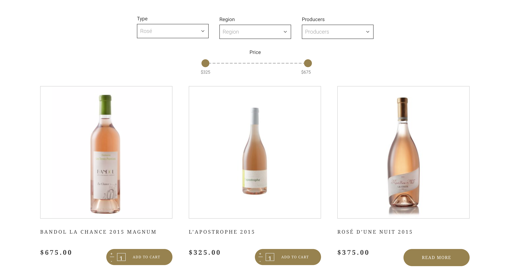

# Benchmark creatie

Omdat er niet veel concurrenten zijn die hetzelde probleem oplossen heb ik besloten de [benchmark](http://cmdmethods.nl/cards/library/benchmark-creation) ceatie te doen omdat benchmarking als een uitgebreider en neutraler alternatief voor concurrentieanalyse kan dienen. Hierbij zoek ik naar producten die op de een of andere manier gerelateerd zijn aan mijn ontwerpdoel. Dit kunnen producten zijn die hetzelfde probleem oplossen of juist een vergelijkbare oplossingsstrategie hanteren. 

### Storytelling

Veel websites maken gebruik van storytelling om een boodschap of beleving over te brengen en een emotionele binding met de gebruiker te realiseren. Een verhaal zorgt bovendien voor een rode draad in de vele content die merken of organisaties tegenwoordig vaak bieden. Storytelling hoeft niet per se te gaan over de ontstaansgeschiedenis van een organisatie.  Er zijn diverse manieren om een visie of boodschap kenbaar te maken in de vorm van een verhaal. Veel websites stimuleren zelfd hun publiek om zelf verhalen te vertellen rondom hun dienstverlening of thema. Hieronder zijn een aantal websites weergeven die gebruik maken van online storytelling. 

Hieronder een aantal voorbeelden van websites die gebruik maken van storytelling. Veel websites maken gebruik van interactieve storytellen door de gebruike door het ontstaan van het merk of product heen te laten scrollen, de website van Cayman Spirits is hier een voorbeeld van.







**Storytelling**

Storytelling stelt marketeers in staat een diepere band met het publiek te ontwikkelen. Verhalen vertellen is een fundamentele menselijke ervaring die mensen verenigt en tot een sterkere of diepere verbindingen leidt. Ook is storytelling is een krachtige methode om te leren. Als marketeers moeten we altijd meer leren over de wereld waarin we leven, de merken die we vertegenwoordigen en de consumenten die we bedienen. Een van de dingen die uniek is aan verhalen is dat ze kennis en betekenis overbrengen. We leren van observaties, ervaringen uit de eerste hand en door die ervaringen te delen via verhalen. Storytelling kan een krachtige tool zijn waarmee marketeers kunnen begrijpen wat er op de markt gebeurt en wat dat betekent voor de klant, consument, maatschappij, merk en bedrijf. \(Whitler, 2018\)

**Waarom storytelling?**

Omdat het voor onze hersenen lijkt te werken. Grote hoeveelheden informatie worden meer verteerbaar in de vorm van een verhaal. Verhalen bewegen en motiveren de gebruiker. Wanneer je goede verhalen vertelt, help je het publiek te banden met jouw merk. 

Als je onderwerp te gevoelig is, kan het helpen om het verhaal te tekenen. Een verhaal is een reis - wat ook impliceert dat het vaak een begin, een midden en een einde heeft - en een centraal personage dat er doorheen gaat. Maar toch, soms heb je zelfs geen mens nodig om een menselijk verhaal te vertellen. Als we verhalen vertellen, denken we woorden, woorden, woorden. Maar een korte video zonder een enkel gesproken woord kan net zo krachtig zijn. \(Erdogan, 2018\)

> "People don't buy what you do, people buy whu you do it" - Simon Sinek

**Elementen van storytelling**

Wees duidelijk en begrijp het hogere doel van waarom je doet wat je doet. Waar staan jij, jouw product, jouw service of jouw merk voor? Het WAAROM is altijd een goed beginpunt. Begin met het waarom \([Simon Sinek](https://www.strategischmarketingplan.com/marketingmodellen/golden-circle-simon-sinek/)\).

Elk verhaal heeft een held nodig. Jij, jouw product, dienst of merk zijn NIET de held. Je gebruikers, klanten of de mensen die u dient zijn wel de 'held'. Je bent hier om je te dienen en je gebruiker te helpen een doel te bereiken, ook al gaat het alleen om het creëren van vreugde en plezier. 

Er zijn verschillende manieren om verhalen te structureren. Een die succesvol is gebleken, is de three-act. Simpel gezegd, er is een begin, een middendeel en een einde aan zo'n verhaal. Deze structuur sluit mooi aan bij een typische customer journey of levenscyclus. 

Bewustwording creëren in verhalen gaat over het teweegbrengen van emotionele reacties. Vreugde, verrassing, verdriet, woede, angst, afkeer. Tenzij je de meest angstaanjagende achtbaanervaring ontwerpt, wil je waarschijnlijk je gebruiker in de meeste gevallen ontlasten voor een negatieve emotie en streven naar vreugde.

Goede verhalen worden gedeeld. Als uw gebruikers hun positieve ervaring met jouw service, merk of product delen, heb je waarschijnlijk goed werk geleverd. Schakel ze in om dit te doen. \( 


De 'held' op de website zou in dit geval de gebruiker of juist de maker van het product zijn. 


### **Personalisatie**

**Diageo**

Een wellicht oude maar leuke actie van Diageo, Diageo plc is een multinational op het gebied van bier en gedestilleerde dranken, met hoofdkantoor in Londen. Diageo introduceerde flessen whisky waarmee kopers gepersonaliseerde videoboodschappen konden opnemen voor Vaderdag in Brazilië. De flessen hadden een QR-code die, wanneer ze werden gescand met een smartphone, hen in staat stelde om hun video te maken. Als het geschenk geopend werd, kon hij dezelfde code op de fles scannen om de persoonlijke boodschap te zien. 

Softwarebedrijf Evrythng bouwde een technologieplatform genaamd +More, waarmee alle Diageo-producten slim worden gemaakt door ze met internet te verbinden. Deze technologie is anders dan de QR-codetechnologie, die alleen iedereen dezelfde boodschap bezorgt. Met +More kan het merk via een fles een op maat gemaakte boodschap aan een individuele consument geven.

Elke fysieke fles wordt omgezet in een interactief, digitaal medium dat consumenten gepersonaliseerde informatie en ervaringen kan bieden, precies wanneer en waar ze willen, beweert het bedrijf.

Met de software kan het bedrijf digitale interactie met fysieke producten gebruiken om informatie en ervaringen voor mensen te leveren, op de tijd en plaats van hun keuze. +More maakt ook digitale interactie mogelijk met winkeliers en andere leveranciers die gegevens analyseren over hoe producten worden gedistribueerd, verkocht en geconsumeerd.

Evrythng oprichter en chief marketing officer Andy Hobsbawm zegt: "Wanneer iemand die fles op Vaderdag geeft, wordt het een uniek item.

> "Diageo maakt ongeveer een miljard flessen premium sterke drank per jaar en op dit moment zijn dit statische assets, ze maken geen deel uit van internet. We zetten die flessen om in eigen stukken van digitale media, dus wanneer een consument verbinding maakt met een fles, wordt het een manier om nuttige diensten, entertainment of informatie te leveren. "

De merken die Diageo in de proef gebruikte waren Johnnie Walker, Buchanan's en Old Parr, en er waren 100.000 flessen bij de drie merken betrokken.

Een woordvoerder van Diageo zegt: "We zijn tevreden met de manier waarop de test in Brazilië is verlopen en hebben daarom de verdere uitrol ervan groen verlicht. \(Alchin, 2013\)

###  Product informatie

Ik heb gekeken naar hoe verschillende websites omgaan met het geven van product informatie. Op dit moment gebeurd dat bij het World of Whisky platform op een standaard en niet spannende manier. Hoe kan Maxxium het weergeven van relevante informatie beter organiseren en ordenen op de website? 

### **Product weergave**

Hoe kan maxxium op een overzichtelijke manier alle verschillende producten/merken weergeven op de nieuwe website? Ik heb gekeken naar andere websites die een groot aantal producten op de website hebben staan en hoe dit weergeven wordt. 

**Bronnen**

Whitler, K \(2018, 14 juli\). 3 Reasons Why Storytelling Should Be A Priority For Marketers. Geraadpleegd op 5 maart 2019, van[ https://www.forbes.com/sites/kimberlywhitler/2018/07/14/3-reasons-why-storytelling-should-be-a-priority-for-marketers/](https://www.forbes.com/sites/kimberlywhitler/2018/07/14/3-reasons-why-storytelling-should-be-a-priority-for-marketers/)

Erdogan, M \(2018, 20 april\). Communicate Less, Say More: Why Storytelling Matters. Geraadpleegd op 20 maart 2019, van [https://medium.com/@mehmeterdoganIV/communicate-less-say-more-why-storytelling-matters-6f4cfa5da807](https://medium.com/@mehmeterdoganIV/communicate-less-say-more-why-storytelling-matters-6f4cfa5da807)

Nessler, D \(2017, 10 mei\). 6 storytelling principles to improve your UX. Geraadpleegd op  15 april 2019, van [https://uxdesign.cc/6-storytelling-principles-to-improve-your-ux-737f0fc34261](https://uxdesign.cc/6-storytelling-principles-to-improve-your-ux-737f0fc34261)

Allchin, J \(2013, 27 maart\). Case study: Diageo’s connected whiskies. Geraadpleegd op 20 maart 2019, van [https://www.marketingweek.com/2013/03/27/case-study-diageos-connected-whiskies/](https://www.marketingweek.com/2013/03/27/case-study-diageos-connected-whiskies/)

