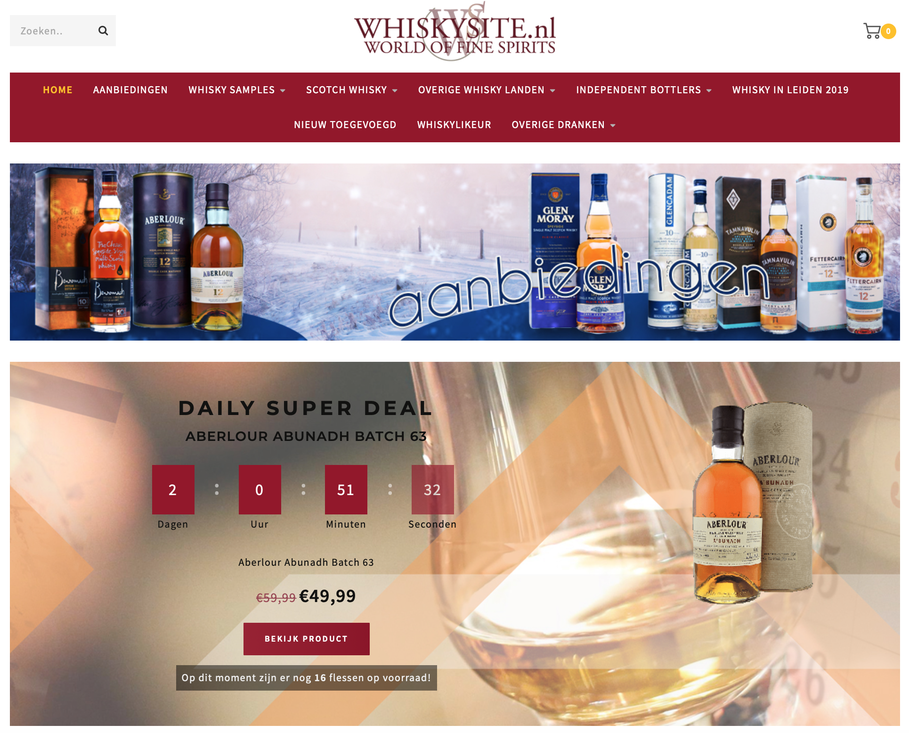
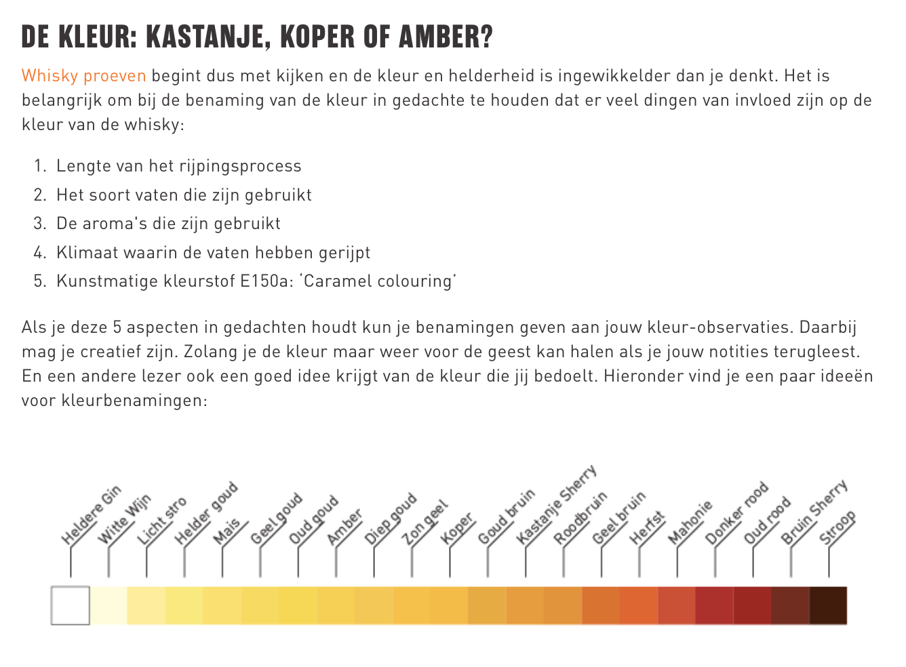
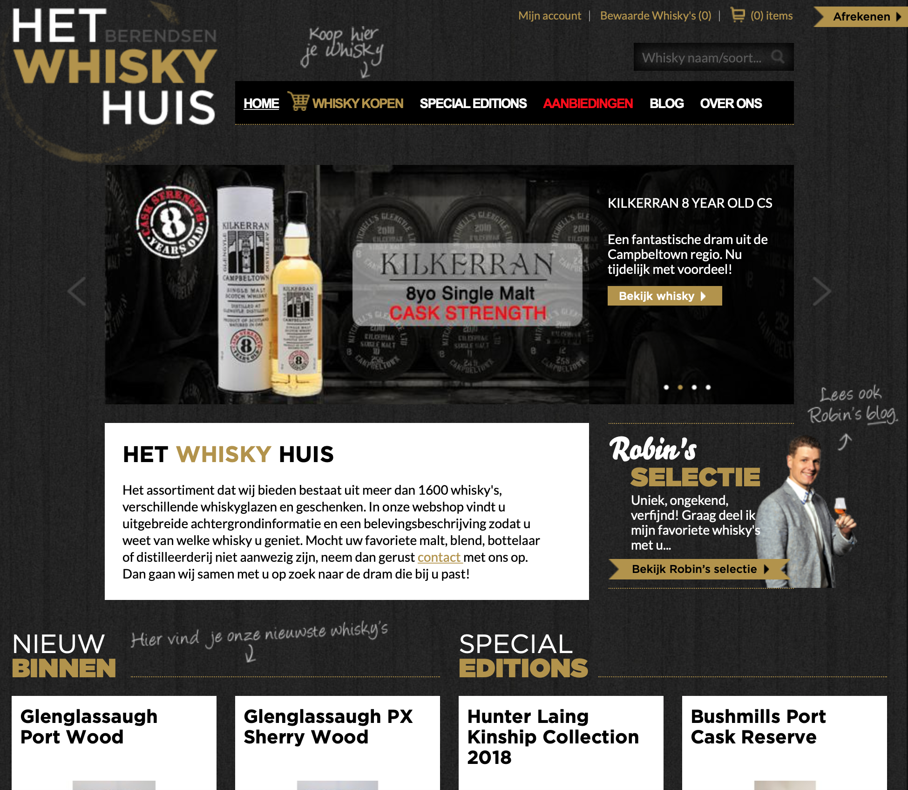
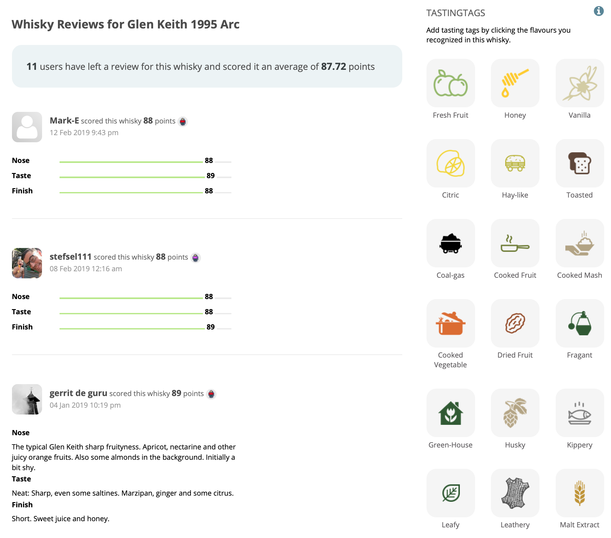
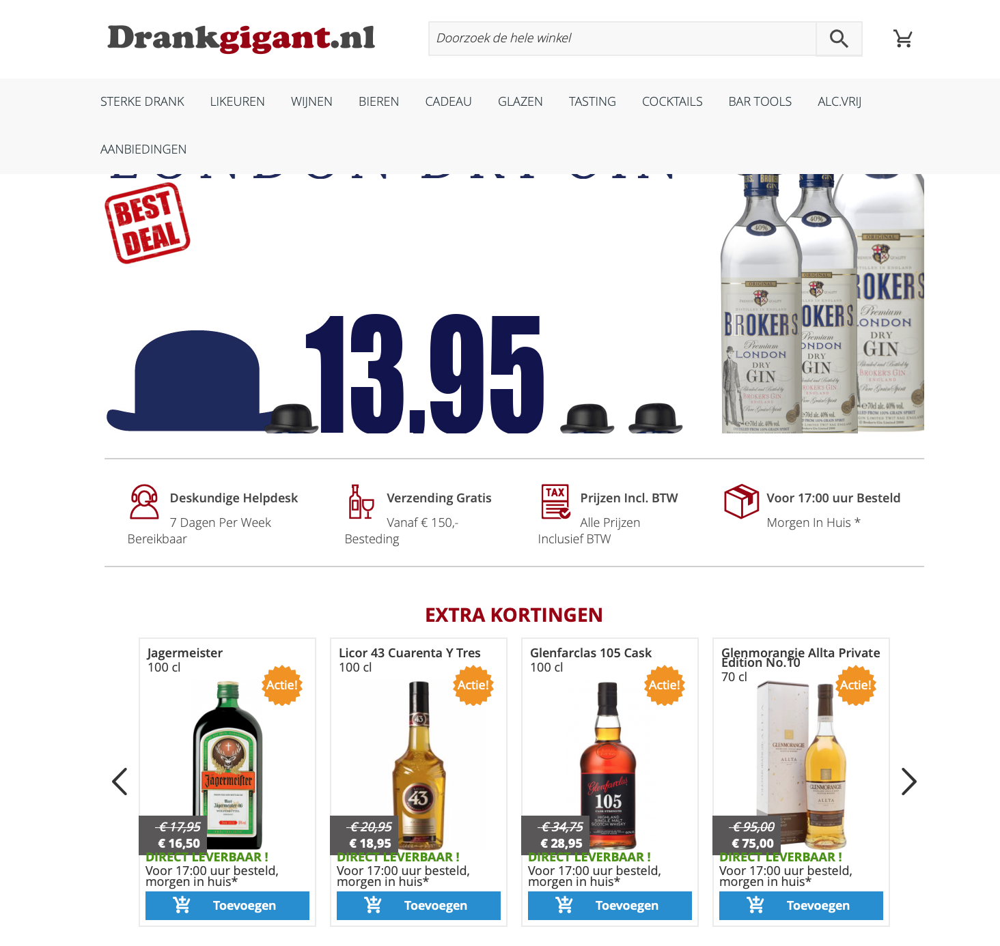
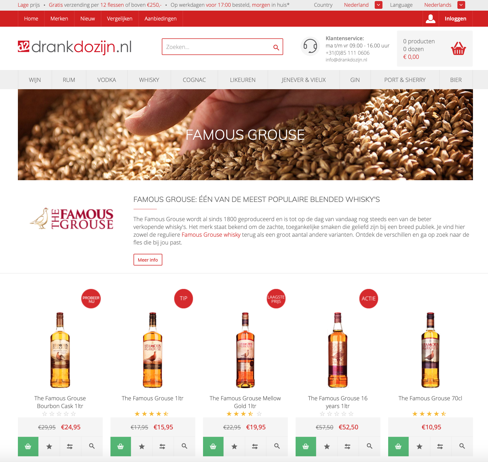

# Competitieve analyse

Bij de competitieve analyse gaat het om het identificeren van de belangrijkste concurrenten en hun aanbod. Niet alleen kan ik hierdoor ontdekken welke gebruikerbehoeften nog niet door de concurrentie worden geadresseerd, maar ook hoop ik geinspireerd te raken door hoe de concurrentie juist wel haar gebruikers weet te bereiken. Voor de competitieve analyse heb ik voornamelijk gezocht naar bedrijven die in de categorie gedestilleerde dranken actief zijn, en niet alleen in de whisky categorie.

### **Concurrentie analyse**

Ik heb gekeken naar bedrijven die online actief zijn in de whisky branche en gekeken naar welke functies zij bieden op hun platform.

<table>
  <thead>
    <tr>
      <th style="text-align:left"></th>
      <th style="text-align:left">
        
<a href="https://www.worldofwhisky.nl">World of </a>
        

        
<a href="https://www.worldofwhisky.nl">Whisky</a>
        

      </th>
      <th style="text-align:left">
        
<a href="https://www.whiskysite.nl/nl/">Whisky </a> 
        

        
<a href="https://www.whiskysite.nl/nl/">site</a>
        

      </th>
      <th style="text-align:left">
        
<a href="https://www.gall.nl/whisky/"><del>Gall</del></a><del>         </del>
        

        
&lt;del&gt;&lt;/del&gt;<a href="https://www.gall.nl/whisky/"><del>&amp; Gall</del></a>&lt;del&gt;&lt;/del&gt;

      </th>
      <th style="text-align:left">
        
<a href="https://www.hetwhiskyhuis.nl">Het whisky</a>
        

        
<a href="https://www.hetwhiskyhuis.nl">huis</a>
        

      </th>
      <th style="text-align:left">
        
<a href="https://www.whiskybase.com">whisky </a> 
        

        
<a href="https://www.whiskybase.com">base</a>
        

      </th>
    </tr>
  </thead>
  <tbody>
    <tr>
      <td style="text-align:left"><b>Filter</b> 
      </td>
      <td style="text-align:left"><b>x</b>
      </td>
      <td style="text-align:left"><b>x</b>
      </td>
      <td style="text-align:left"><b>x</b>
      </td>
      <td style="text-align:left"><b>x</b>
      </td>
      <td style="text-align:left"><b>x</b>
      </td>
    </tr>
    <tr>
      <td style="text-align:left"><b>Webshop (Whisky)</b>
      </td>
      <td style="text-align:left"></td>
      <td style="text-align:left"><b>x</b>
      </td>
      <td style="text-align:left"><b>x</b>
      </td>
      <td style="text-align:left"><b>x</b>
      </td>
      <td style="text-align:left"><b>x</b>
      </td>
    </tr>
    <tr>
      <td style="text-align:left"><b>Webshop (Merch)</b>
      </td>
      <td style="text-align:left"><b>x</b>
      </td>
      <td style="text-align:left"></td>
      <td style="text-align:left"></td>
      <td style="text-align:left"></td>
      <td style="text-align:left"></td>
    </tr>
    <tr>
      <td style="text-align:left"><b>Informatie over smaak</b>
      </td>
      <td style="text-align:left"><b>x</b>
      </td>
      <td style="text-align:left"><b>x</b>
      </td>
      <td style="text-align:left"><b>x</b>
      </td>
      <td style="text-align:left"><b>x</b>
      </td>
      <td style="text-align:left"><b>x</b>
      </td>
    </tr>
    <tr>
      <td style="text-align:left"><b>Geschiedenis</b>
      </td>
      <td style="text-align:left"><b>x</b>
      </td>
      <td style="text-align:left"><b>x</b>
      </td>
      <td style="text-align:left"><b>x</b>
      </td>
      <td style="text-align:left"><b>x</b>
      </td>
      <td style="text-align:left"></td>
    </tr>
    <tr>
      <td style="text-align:left"><b>Herkomst</b>
      </td>
      <td style="text-align:left"><b>x</b>
      </td>
      <td style="text-align:left"><b>x</b>
      </td>
      <td style="text-align:left"><b>x</b>
      </td>
      <td style="text-align:left"><b>x</b>
      </td>
      <td style="text-align:left"><b>x</b>
      </td>
    </tr>
    <tr>
      <td style="text-align:left"><b>Prijsindicatie</b>
      </td>
      <td style="text-align:left"><b>x</b>
      </td>
      <td style="text-align:left"><b>x</b>
      </td>
      <td style="text-align:left"><b>x</b>
      </td>
      <td style="text-align:left"><b>x</b>
      </td>
      <td style="text-align:left"><b>x</b>
      </td>
    </tr>
    <tr>
      <td style="text-align:left"><b>Verkooppunten</b>
      </td>
      <td style="text-align:left"><b>x</b>
      </td>
      <td style="text-align:left"><b>x</b>
      </td>
      <td style="text-align:left"></td>
      <td style="text-align:left"></td>
      <td style="text-align:left"></td>
    </tr>
    <tr>
      <td style="text-align:left"><b>Reizen</b>
      </td>
      <td style="text-align:left"><b>x</b>
      </td>
      <td style="text-align:left"></td>
      <td style="text-align:left"></td>
      <td style="text-align:left"></td>
      <td style="text-align:left"></td>
    </tr>
    <tr>
      <td style="text-align:left"><b>Beoordelingen</b>
      </td>
      <td style="text-align:left"></td>
      <td style="text-align:left"><b>x</b>
      </td>
      <td style="text-align:left"><b>x</b>
      </td>
      <td style="text-align:left"><b>x</b>
      </td>
      <td style="text-align:left"><b>x</b>
      </td>
    </tr>
    <tr>
      <td style="text-align:left"><b>Interactie</b>
      </td>
      <td style="text-align:left"></td>
      <td style="text-align:left"></td>
      <td style="text-align:left"></td>
      <td style="text-align:left"></td>
      <td style="text-align:left"><b>x</b>
      </td>
    </tr>
    <tr>
      <td style="text-align:left"><b>Responsive</b>
      </td>
      <td style="text-align:left"><b>x</b>
      </td>
      <td style="text-align:left"><b>x</b>
      </td>
      <td style="text-align:left"><b>x</b>
      </td>
      <td style="text-align:left"><b>x</b>
      </td>
      <td style="text-align:left"><b>x</b>
      </td>
    </tr>
    <tr>
      <td style="text-align:left"><b>Recepten</b>
      </td>
      <td style="text-align:left"><b>x</b>
      </td>
      <td style="text-align:left"></td>
      <td style="text-align:left"></td>
      <td style="text-align:left"><b>x</b>
      </td>
      <td style="text-align:left"></td>
    </tr>
    <tr>
      <td style="text-align:left"><b>Video content </b>
      </td>
      <td style="text-align:left"></td>
      <td style="text-align:left"></td>
      <td style="text-align:left"></td>
      <td style="text-align:left"></td>
      <td style="text-align:left"></td>
    </tr>
  </tbody>
</table>
De websites die ik heb gebruikt voor de concurrentie analyse zijn vooral actief als webshop. Veel van de websites hebben het doel om te verkopen terwijl Maxxium juist als uitgangspunt heeft om haar bezoekers te inspireren. 




### Whiskysite.nl 

Whisky site is een online webshop voor whisky en is dus geen bedreiging wat concurrentie betreft. De site heeft weinig relevante informatie voor beginnende whiksy drinkers. De enige informatie is te vinden bij de flessen zelf maar ook hier is de content beperkt. De site is duidelijk alleen bedoeld voor het verkopen van de flessen en niet het inspireren of informeren van de gebruikers. 




### Gall & Gall

Gall & Gall is bekend als slijterij en webshop maar geeft in vergelijking met de andere webshops meer informatie aan haar gebruikers. Zij hebben verschillende blog artikelen die de gebruiker op weg helpen met het kiezen van het juiste smaakpalet. Ook bij deze website heb de gebruikers de mogelijkheid om een review te plaatsen. 




### Hetwhiskyhuis.nl

Het whiskyhuis.nl is een offline en online slijterij. Naast dat zij een webshop hebben houden zij een blog bj op de website. In deze blog artikelen geven ze de bezoeker informatie over \(nieuwe\) producten en distilleerderijen. De informatie bij de producten is erg beperkt en ook hier kunnen de gebruikers beoordelingen achterlaten. Aan de beoordelingen op de website te zien wordt deze reactie mogelijkheid nauwelijks gebruikt.




### Whiskybase.nl

Whisky base is een website die de gebruiker in staat stelt om whisky soorten te ontdekken en te beoordelen. Ze hebben een groot assortiment die beroordeeld kan worden door iedere bezoeker door middel van tasting tags en punten. Gebruikers kunnen daarnaast via hun eigen account een online collectie beheren. Deze online collectie houdt in dat gebruikers altijd een overzicht hebben van welke flessen zij thuis hebben en hoeveel de waarde hiervan is. De site geeft bezoekers de mogelijkheid om flessen te verkopen en kopen. 





Ik merk bij veel sites dat gebruikers reviews kunnen achter laten. De reacties die mensen hier achterlaten zijn vrij beperkt en komen veelal overeen met "goede whisky" of "erg lekker". Ik vraag mij af hoe relevant deze reacties zijn omdat iedereen zijn smaakbeleving anders is. In tegenstelling tot de rest doet Whiskybase dit op een interessantere manier door de gebruiker de geur en smaak met punten te beoordelen en te laten kiezen uit smaaktags. Op deze manier kunnen mensen zich beter inbeelden waarom de desbetreffende whisky goed of lekker is. 



Na het gesprek met Tony van Rooijen heb ik twee extra concurrenten toegevoegd: drankgigant en drankdozijn. Dit zijn bedrijven die voor een lager bedrag producten verkopen op hun website. Zij kunnen deze producten aanbieden door de parallelimport, dit is de import buiten de officiële kanalen om. Gall & Gall wordt niet gezien als concurrent omdat Maxxium zelf de drank levert aan Gall & Gall. 




Drankgigant is een online slijterij met een aanbod van meer dan 14,000 producten. De reden dat dit als concurrent wordt gezien is omdat drankgigant de producten die Maxxium promoot, verkoopt voor minder dan de marktwaarde. Maxxium kan niet concurreren met deze prijzen omdat zij op een legale manier de merken inporteren naar Nederland. Drankgigant koopt haar assortiment van importeurs uit andere landen omdat hier andere regels voor gelden dan in Nederland. Dit maakt dat Maxxium de marketing doet terwijl drankgigant er met de verkoop vandoor gaat.   




Drankdozijn handelt op dezelfde manier als drankgigant, namelijk via de parallelhandel. Drankdozijn wordt wel gezien als mindere concurrent omdat zij minder producten aanbieden dan Drankgigant. 




