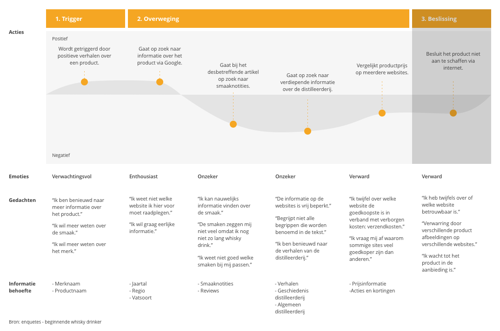

# Customer journey

~~Ik heb in de eerste fase van het project een customer journey gemaakt die gaat over de whisky reis. Dit is de reis die de gebruiker maakt vanaf het begin dat hij whisky drinkt tot aan het moment dat hij 'ervaren' is. De customer journey geeft inzicht in hoe het proces verloopt en welke kansen er liggen per fase.~~ 

Ik zie deze customer journey niet als leidend omdat de input hiervan uit een presentatie uit 2013 over het World of Whisky platform afkomstig is. Dit is vanuit Maxxium het enige onderzoek geweest naar de doelgroep. Ondertussen zijn er veel merken verwijderd en geintroduceerd en is wellicht het kennis niveau van de doelgroep toegenomen. Onderstaand is de afbeelding uit de presentatie te zien die ik gebruikt heb als input van de whisky reis samen met het eigen onderzoek.

Aan de hand van Google Analytics ben ik begonnen met het maken van een cutstomer journey van het huidige gebruik van de website. Hierbij heb ik de nieuwsbrief als uitgaanspunt genomen omdat deze zorgt voor veel verkeer naar de website. Deze customer journey heb ik niet afgemaakt omdat deze gaat over een andere doelgroep dan ik gekozen heb voor mijn project. De doelgroep die namelijk de nieuwsbrieven ontvangt en gebruik maakt van het platform is niet de doelgroep waar ik mij op wil richten omdat ik juist nieuwe mensen naar het platform wil trekken. Ook heb ik niet genoeg informatie door alleen Google Analytics te gebruiken. Om een customer journey te maken waar ik ook de pijnpunten en emtoties van de gebruiker in opneem heb ik meer informatie over deze doelgroep nodig. Ik heb er bewust voor gekozen om de huidige gebruiker niet verder te onderzoeken omdat ik los wil denken van het platform zoals het nu is. Huidige gebruikers komen waarschijnlijk met punten die beter kunnen en denken daarbij niet aan een gehele nieuwe oplossing om aan hun eisen te voldoen. Daarnaast zijn dit zo weinig gebruikers dat een site die volledig op hun behoefte is gemaakt niet volstaat.  

Omdat ik de eerste versies van mijn customer journey niet relevant meer vind en ik niet weet waar het oorspronkelijke onderzoek is waar dit op gebasseerd is, wil ik een customer journey maken van de doelgroep die ik gekozen heb, namelijk de bginnende whisky drinker. 

In bovenstaande customer journey is te zien welke informatie behoefte de beginnende whisky drinker heeft. Voor mijn product is voornamelijk de tweede fase relevant omdat hij hier de behoefte heeft aan kennis en informatie. Uit de huidige situatie blijkt dat de gebruiker net goed weet waar hij welke informatie kan vinden en is er weinig uitleg over de whisky. 

