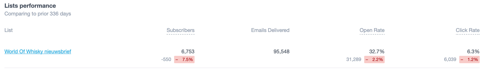
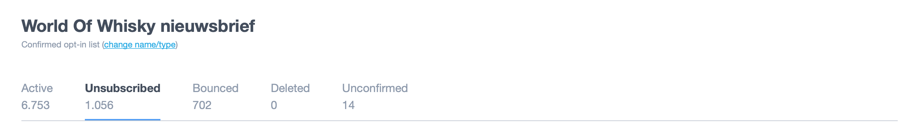

# Campaign monitor

Maxxium maakt gebruik van het software programma [campaign monitor](https://www.campaignmonitor.com). Via dit programma kunnen we precies zien op welke links in de nieuwsbrief van World of Whisky de gebruikers hebben geklikt. Maxxium heeft een database voor ongeveer 7000 mensen die geabonneerd zijn op de nieuwsbrief, waarvan steeds meer mensen zich uitschrijven. Dit blijkt uit onderstaande afbeelding. 

Uit de onderstaande analyse van campaign monitor blijkt welke onderwerpen de gebruiker interessant vindt en en triggert om naar de website te gaan. 

| Populaire onderwerpen februari | Unieke clicks | Click ratio |
| :--- | :--- | :--- |
| Limited editie whisky | 292 | 43% |
| Whisky quiz | 216 | 34% |
| Begrippenlijst | 58 | 9% |

| Populaire onderwerpen januari | Unieke clicks | Click ratio |
| :--- | :--- | :--- |
| Nieuw product | 518 | 49% |
| Whisky quiz | 226 | 20% |
| Begrippenlijst | 57 | 6% |

| Populaire onderwerpen december | Unieke clicks | Click ratio |
| :--- | :--- | :--- |
| Whisky quiz | 176 | 30% |
| Proefkalender | 148 | 22% |
| Recepten | 120 | 21% |

| Populaire onderwerpen november | Unieke clicks | Click ratio |
| :--- | :--- | :--- |
| Evenement \(diner\) | 257 | 27% |
| Proefkalender | 241 | 26% |
| Whisky quiz | 152 | 16% |

| Populaire onderwerpen september | Unieke clicks | Click ratio |
| :--- | :--- | :--- |
| Whisky quiz | 142 | 24% |
| Blog artikel | 129 | 22% |
| Recept | 129 | 22% |

| Populaire onderwerpen augustus | Unieke clicks | Click ratio |
| :--- | :--- | :--- |
| Nieuw product | 315 | 41% |
| Whisky quiz | 142 | 19% |
| Evenement \(diner\) | 95 | 13% |


De onderwerpen die de gebruiker het vaakst aan klikt in de nieuwsbrief zijn de quiz, evenementen/proefkalender en de nieuwe producten.


