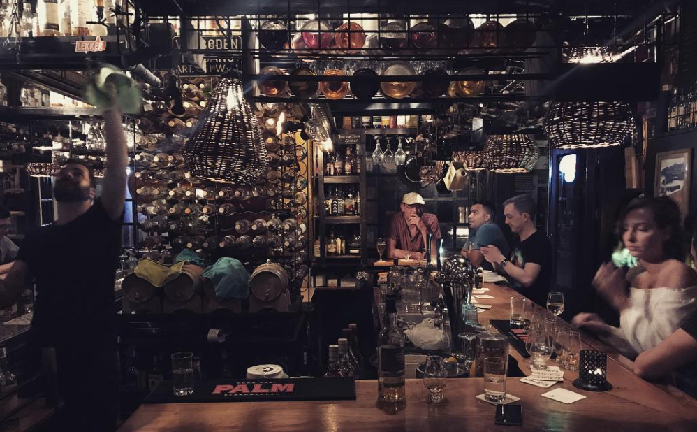

# Fly on the wall

Om het gedrag van de whisky drinkers in de context te zien van het nuttigen van de drank ben ik naar een whisky bar gegaan. Hier heb ik gelet op hoe mensen zich gedragen, met wie zij zijn en waar zij het over hebben. Ook heb ik na mijn observatie een aantal mensen gesproken en vragen gesteld over hun ervaringen en doelen. 

**Whisky bar L&B**

Deze bar bevind zich op Leidseplein heeft een collectie van meer dan 2100 whisky's. Ik ben naar de whisky bar gegaan op een vrijdag avond in de hoop dat ik hier de meeste mensen zou treffen. Wat opviel was dat er veel engelse aanwezig waren. De aanwezigheid van de hoeveelheid toeristen heeft zonder twijfel te maken met de locatie. Voor het onderzoek heb ik mij zo veel mogelijk op de Nederlandse bezoekers gefocust omdat dit hoog waarschijnlijk in de eerste instantie de eindgebruikers van mijn product zullen zijn. Dit heb ik gebasseerd op het feit dat Maxxium zijn producten in Nederland verkoopt en dus ook zo veel mogelijk de potentiele consumenten hiervan wil inspireren en informeren. Dit wil niet zeggen dat ik niet gekeken heb naar de buitenlandse bezoekers van de whisky bar. 

**Groep bezoekers \(Nederlands en buitenlands gemengt\)**

Buiten het cafe staat een groep mannen met een glas whisky in hun hand. De afkomst van deze mensen is gemengt. Een aantal mensen spreken Nederlands met elkaar terwijl de andere helft in het engels communiceert. Het is mij in de eerste instantie niet duidelijk of ze bij elkaar horen. Het gaat om een groepje van ongeveer 5 mensen waarvan 1 iemand een sigaret op steekt. Omdat ik mij nogal ongemakkelijk voel bij alleen het observeren van de mannen besluit ik een gesprek aan te knopen. Omdat ik niet direct wil vertellen dat ik alleen geinteresseerd ben in het gedrag en de gesprekken van de whisky drinkers besluit ik om een advies te vragen. Ik vertel twee mannen dat ik graag een glas whisky wil proberen maar dat ik wel wat hulp kan gebruiken bij het kiezen van de juiste. Een van de mannen reageert enthiousiast en is bereid mij te helpen. Ondertussen ben ik erachter dat het groepje die buiten staat collega's zijn die na de vrijdag middag borrel nog even afsluiten bij de whisky bar. Slechts 1 van de mannen is ervaren whisky drinker en heeft zijn collega's overtuigd om een glas whisky te drinken. 3 mannen zijn Nederlands en de mannen met wie ik een gesprek heb aangeknoopt zijn afkomstig uit Pakistan en Iran \(of Irak?\). Wel zijn ze allemaal woonachtig in Nederland en dus geen toeristen. De gesprekken gaan in dit geval voornamelijk over de afkomst van de mensen en het werk van de mannen \(programmeurs en financieel en business intelligence/ data specialist\). De gesprekken die we hebben gaan eigenlijk bijna niet over whisky. De gesprekken die we hebben gaan onder andere over de ingekerfte teksten op de toilet deuren en hoe mensen hier zelfs op elkaar reager over politieke voorkeuren. Daarnaast zijn het gesprekken over hoe de dronken toeristen zich voortbewegen door de straten van het Leidseplein en over de beste turkse pizza tent in de buurt. Wat ik vooral merk is dat de mensen heel open en spontaan zijn, ondanks dat ze niet dronken op mij overkomen. 

Ik vraag een van de Nederlandse bezoekers of hij de website Worldofwhisky.nl kent. Hij heeft de website naar zijn weten nog nooit bezocht. Bij het laten zien van de mobiele website heb ik om zijn mening gevraagd. 

"is het een verkoopsite of een informatie site? Ik snap niet helemaal goed op wat voor website ik zit omdat er staan "onze merken. Als ik er op klik zie ik maar een aantal merken maar ik zie niet waar ik ze kan kopen." 

"Ik vind het heel onduidelijk en ik zou niet zo goed weten welke informatie ik hier kan vinden. Er staat hier heel groot: Opzoek naar een whisky, wij helpen je zoeken. Maar ik voel me niet echt geholpen. Nu ken ik deze merken wel al dus ik weet wat ik lekker vind. Maar ik kan me voorstellen dat andere mensen iets meer hulp nodig hebben? Wel goed dat er smaak notities bij staan"

"Ik zou een kopje "over ons" verwachten omdat ze het telkens hebben over 'we'. wie zijn 'we'? 

"Ik zou deze site misschien alleen bezoeken voor de proefkalender. De informatie over de merken vind ik een beetje ongeorganiseerd en ik kan niet alle merken vinden." 


Website is niet duidelijk in communicatie over wie 'world of whisky' is. Nergens komt naar voren waarom er maar een aantal merken aan bod komen. Hier moeten zij dus in een volgens product transparant over zijn. 


**2 heren \(Nederlands\)**

Aan de bar zitten twee mannen die twijfel achtig naar het menu kijken. Ik weet niet zeker of deze mannen veel verstand hebben van whisky of juist niet. Omdat het gehorig is kan ik niet horen wat ze bestellen. Een van de heren bestelt een whisky en de ander een biertje. Voor de rest valt er niet veel op aan de manier waarop zij zich gedragen. De whisky bar is niet veel anders dan een normale bar behalve dat de meerderheid van de mensen mannelijk is en dat er weinig koppels rond hangen. 

Ik kan geen betere reden bedenken dan de linker man te vragen waarom hij een biertje drinkt in een whisky bar met zoveel keuze. Het antwoord is vrij simpel: "ik hou niet van whisky". Hij legt uit dat hij niet van het sterke spul is en veel liever een biertje neemt. De twee heren zijn niet bewust naar een whisky bar gegaan maar kwamen hier toevallig uit. Ze komen beide uit Zaandam en zijn net wezen eten ergens in Amsterdam. Ik vertel dat ik bezig ben met een onderzoek naar een online whisky platform en of de meneer die wel een whisky drinkt wel eens dergelijke websites bezoekt. Nee is het antwoord. Omdat de andere meneer een bierliefhebber is ben ik benieuwd of hij wel eens websites bezoekt die over bier gaan. Dit doet hij eigenlijk nooit. "Ik drink vaak speciaalbier in de kroeg of thuis maar dat is meer een kwestie van experimenteren. Het interesseerd mij eigenlijk niet heel veel hoe het gemaakt is of wat het verhaal er achter is". Als ik hem vraag of hij het ook niet interessant zou vinden om naar een bierbrouwerij te gaan voor een rondleiding laat hij weten dat dat hem wel leuk lijkt. Ondertussen dwaalt het gesprek een beetje af en gaat het voornamelijk over bier in plaats van whisky. 

Ik laat hen de mobiele World of Whisky website zien en vraag of ze hier kort doorheen willen navigeren.

"Ik zie dat ze ook whisky reizen hebben, dat lijkt me dus wel een keer leuk om te doen. Oh há, niet via hier, wat een prijzen \(de whiskyreizen\)."  Geeft wel aan dat hij geen idee heeft wat zoiets moet kosten omdat hij er geen ervaring mee heeft. 

Navigeert naar whiskyzoeker: "Kan ik niet op naam zoeken? Ik wil de whisky zoeken die ik aan het drinken ben. Of moet ik dan deze hele lijst door. Oh wacht ik kan hier kiezen \(filter\)." Ziet vervolgens het merk er niet tussen staan: "hoe kan ik nu alle merken zien?" 

De meneer geeft aan niet heel handig te zijn met smartphones maar snapt niet of zijn filter al is toegepast. Maakt een grapje over dat de doelgroep \(dronken mensen\) vast niet met deze kleine knopjes om kan gaan. 

"Kloppen deze prijzen?" Prijzen die tussen de lijst staan varieren van 5000 euro tot 60 voor zover ik kan zien. Ik moet toegeven dat ik geen idee heb omdat ik weet dat Maxxium een aantal goede whisky's heeft voor lagere prijzen. Het valt mij nu ook zelf pas op dat de goedkopere whisky's onderaan in de lijst staan. 


Kan niet goed omgaan met het filter en is gefrustreerd dat hij niet kan zoeken op zijn eigen merk.  
  
Prijzen staan automatisch gesorteerd op hoog naar laag. Voor de beginnende drinker afschrikkend. 


Een aantal mensen in het cafe heb ik niet aangesproken omdat die er voor mijn gevoel niet erg toegankelijk uit zagen. Bij sommige mensen was het makkelijk om een gesprek aan te knopen maar bij andere voelde de drempel iets te hoog. 1 meneer die alleen was had ik wel aan willen spreken omdat het er uitzag alsof hij verstand had van whisky's. Alleen ik kreeg de indruk dat hij al een aantal glazen op had. 

**Café ZILT Amsterdam**

Het percentage mannen en vrouwen is hier een stuk beter verdeeld. Daarbij valt het wel op dat veel mensen geen whisky drinken maar hebben gekozen voor bier. Deze bar heeft ook iets minder de uitstraling van een whiskybar, behalve dat het personeel in overhemd en gilet loopt. Op de een of andere manier voel ik mij hier minder zeker om mensen aan te spreken. Waarschijnlijk komt het omdat mensen in grotere groepen zijn. 

**Laurens** \(Ervaren whisky drinker en barman\)

Als je eenmaal goede whisky hebt ervaren, wil je hier meer over weten. Het maakt je nieuwschierig. De geur en intense smaak houden je aandacht vast. Voor sommigen is het de geschiedenis; elk merk heeft een eigen verhaal, een verhaal om te verkopen. Anderen zien whisky als een vorm van kunst. De distilleerder is hierbij de kunstenaar. Genieten van van whisky is ons een manier om de 'kunstenaar' de eren. Sommige mensen houden van whisky gewoon omdat het whisky is of voor alles wat daarbij hoort; de smaak, geur, aroma's. Echt alles. Het kan ze herinneren aan een bepaald moment of laat ze momenten herbeleven. 

In tegenstelling tot andere dranken heeft whisky verschillende kenmerken waardoor ze zich van elkaar onderscheiden. Over het algemeen is Bourbon zoet, Rye is pittig en meestal is Scotch rokerig. Er is een heel scala aan aroma's om te ervaren. Het is niet moeilijk om een ​​idee te krijgen van de verschillende soorten whisky's. Elk type whisky heeft een heel specifiek smaakprofiel. Je zult snel ontdekken welke je lekker vindt en welke niet. Maar het is natuurlijk ook mogelijk om ze allemaal te waarderen en te respecteren voor hun eigen karakteristiek. Wist je trouwens dat vrouwen beter zijn in het onderscheiden van smaken dan mannen? Maar dat ter zijde haha. Er één ding waar ik verslaafd aan ben, dat is wanneer iemand een fles opent en ik de geur van whisky ruik. Zonder het ruiken kun je niet proeven. Geurende whisky bereidt je voor op de smaak, of schrikt je af. Ik vergelijk het meestal als het kijken naar de trailer voordat je de film ziet. Het verhoogt je verwachting en maakt drinken van de whisky des te meer de moeite waard!

Dus, de volgende keer als je in een whisky bar bent of thuis drinkt, en die fles whisky opent. Zorg ervoor dat je eerst de geur in je op neemt. Het is een van de leukste dingen van het 'drinken' van whisky's. 


Opvallent bij bijde locaties is dat er voornamelijk mannelijke bezoekers én mannelijk personeel rond loopt. Dit kwam ook al naar voren uit de enquetes. 


