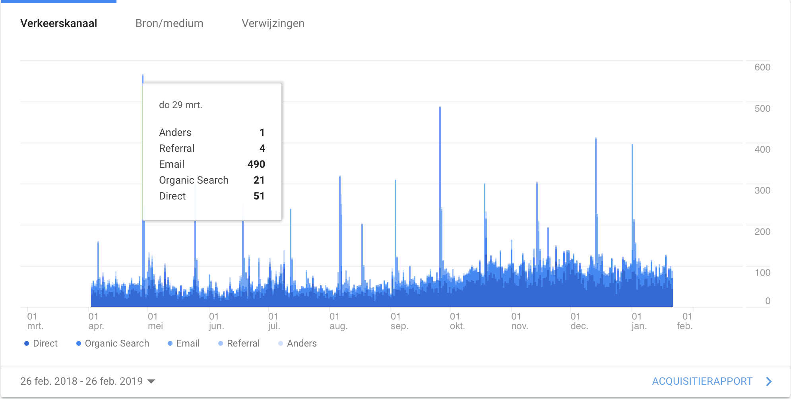
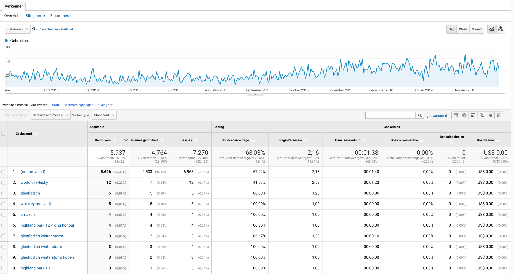
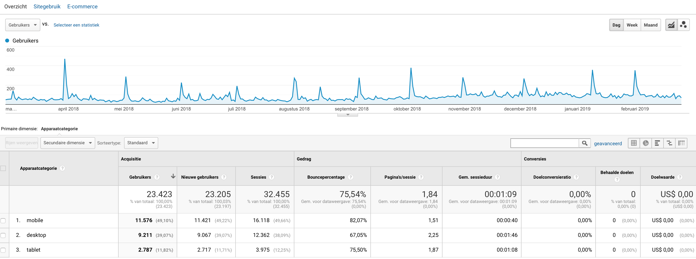
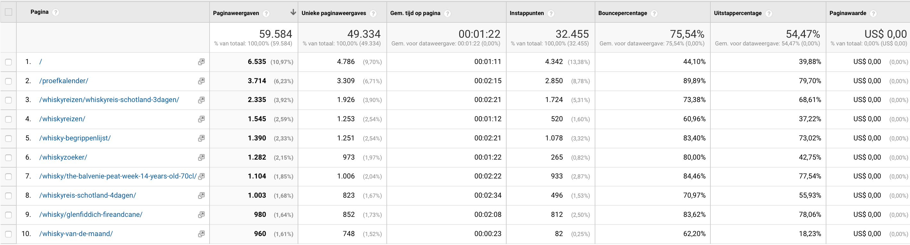

# Google analytics

Maxxium heeft Google Analytics ingeschakeld voor het World of Whisky platform. De data die hier op staat is dus gefocust op de huidige gebruiker. De huidige gebruikers varieëren van gelegenheids whisky drinkers tot ervaren whiksy drinkers. 

De data die ik uit Google Analytics wil halen is gaat voornamelijk over het gedrag van de gebruiker. Dingen die ik zal analyseren zijn onder andere via welke bron de gebruiker binnen komt en hoe de gebruiker zich door de pagina navigeert. Onderstaand zijn deelvragen opgesteld en beantwoord die gaan over de huidige situatie van de gebruiker. Hierbij zal ik alleen de dingen benoemen die afwijkend of opvallend zijn.

**Via welk verkeer komt de gebruiker op het World of Whisky platform binnen?**

Ik heb gegekeken naar de statestieken over een jaar. De datum staat ingesteld op 26 februari 2018 tot 26 februari 2019. Het eerst dat opvalt aan het overzicht is dat er een aantal pieken zijn bij het email verkeer. Deze hoge aantallen corresponderen met de maandelijke emails die Maxxium stuurt naar haar World of Whisky abbonees. De emails zorgen dus voor veel website verkeer. Ondanks de hoge pieken komt _58% van het website verkeer binnen via direct search._ Hieruit kan ik concluderen dat de meeste gebruikers al bekend zijn met het platform en niet via een search engine binnen komen. _Op de tweede plaats staat organic seach met 23,7%._

De meest gebruikte zoektermen op Het platform zijn moeilijk te achterhalen omdat deze 'not provided' zijn. Op de 2e plek staat de zoekterm 'World of Whisky'. Omdat mensen hierbij gericht zoeken naar de website via organic search is het bounce percentage lager dan de overige zoektermen. Als mensen zoeken op 'Glenfiddich' haakt 80% van de gebruikers af, en bij de zoekterm ''whisky proeverij' zelfs 100% van de gebruikers. Ondanks dat deze onderwerpen wel op de webiste staan voldoen deze duidelijk niet aan de verwachtingen van de gebruikers.

Via de detail pagina van het directe verkeer blijkt dat de meeste mensen op de homepagina binnenkomen \(12%\) en op de tweede plek de proefkalender \(9,4%\). Hieruit kan ik opmaken dat bezoekers geïnteresseerd zijn in de whisky proeverijen. Het bouncepercentage van dit verkeer is wel hoog, namelijk 92,55%. Dit hoge percentage kan twee dingen betekenen: mensen vinden de evenementen niet interessant, of ze navigeren door naar de externe websites van de evenementen. 

De meeste gebruikers gebruiken de website via hun telefoon. Het bouncepercentage ligt hier hoger dan op de andere devices, dit kan betekenen dat de website niet goed geoptimaliseerd is voor mobiel. 

De meest bezochte pagina's op de huidige website zijn de homepagina, proefkalender en reizen. 

