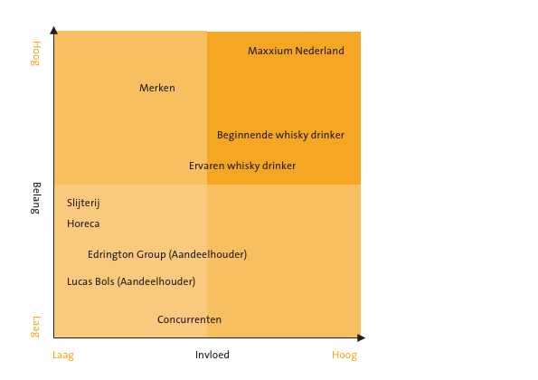

# Stakeholder analyse

Bij de stakeholder analyse zal ik de belangen en conflicterende belangen in kaart brengen van de verschillende stakeholders en belanghebbende. Ik maak hierbij onderscheid tussen twee soorten stakeholders; primaire en secundaire. De primaire stakeholder heeft direct invloed op de project aanpak of het resultaat terwijl de secundaire stakeholder alleen indirect invloed heeft op de projectaanpak of het resultaat. Daarnaast worden de stakeholders in 3 verschillende categorieën ingedeeld: De interne stakeholder; bij het project betrokken vanuit eigen organisatie. De externe stakeholder; bij het project betrokken externe partij. Interface stakeholder; Interface stakeholders kunnen van invloed zijn op de organisatie door middel van wet- en regelgeving. Dit zijn dus overheden, bonden en \(educatieve\) instanties **\(**We Think Next, z.d.\).

### **Gebruikers** 

Om meer informatie te verzamelen over de gebruikers van het platform heb ik gebruik gemaakt van verschillende onderzoekstechnieken zoals [enquetes](enquete/) en[ fly on the wall](fly-on-the-wall.md). Alle informatie die ik verzameld heb over de gebruiker is omgezet in [persona's](1.8-persona.md). De gebruiker is verdeeld in twee groepen: de beginnende whisky drinker en de ervaren whisky drinker. 

**Beginnende whisky drinker** 

Stakeholder groep: primaire stakeholder  
Soort stakeholder: externe stakeholder

De beginnende whisky consument heeft drinkt af en toe whisky maar heeft nog weinig idee van welk soort smaak hem zal bevallen, en is overweldigd door de ruime keuze aan soorten whisky en kan de verschillende smaken niet onderscheiden. De beginnende drinker drinkt voornamelijk toegankelijke whisky soorten, of kiest voor een merk waar hij/ zij ervaring mee heeft. De doelgroep drinkt het liefst in sociale omstandigheden zoals in de kroeg of bij vrienden.

_Belangen van stakeholder \(Bron:_ [_enquetes_](enquete/)_\)_

Deze stakeholder heeft belang bij het bestaan van het product omdat ze een plek willen hebben waar alle informatie over whisky te vinden is. Deze informatie behoefte gaat over het ontstaan van whisky in het algemeen en de verschillende soorten whisky tot de smaaknotities en evenementen. De stakeholder profiteert er van als dergelijke informatie op één kanaal is te vinden met duidelijke taal die te begrijpen is voor mensen met basis kennis van whisky. 

_Invloed van stakeholder_

De beginnende whisky drinker is degene die vraag heeft naar een plek om kennis op te doen. Aan de hand van het huidige kennis niveau van de beginnende whisky drinker zal bepaald worden welke informatie er beschikbaar zal zijn. Naast het opdoen van informatie zijn er nog andere verlangen en doelen die de beginnende whisky drinker heeft. Hier móét rekening mee gehouden worden wil het platform of iets dergelijks kunnen bestaan.

**Ervaren whisky drinker** 

Stakeholder groep: primaire stakeholder  
Soort stakeholder: externe stakeholder

Ervaren whisky drinkers kunnen de vele verschillende smaak- en geuraccenten van whisky goed onderscheiden. Zij zijn bekend met de verschillende merken en hebben een voorkeur voor smaken. Ervaren whisky drinkers bezoeken evenementen zoals whisky proeverijen en weten de plekken voor een goed glas whisky te vinden. 

De exacte doelen en behoeftes van de doelgroep zullen tijdens het project nog onderzocht moeten worden. Ik zal voornamelijk gaan kijken naar wat de behoeftes van de doelgroepen zijn en aan welke informatie zij behoefte hebben. 

_Belangen van stakeholder \(Bron:_ [_enquetes_](enquete/)_\)_

Deze stakeholder heeft belang bij het bestaan van het product omdat ze een plek willen hebben waar alle informatie over whisky te vinden is. Deze informatie behoefte gaat over de geschiedenis van bepaalde whisky's en de bereiding tot de smaaknotities. De stakeholder profiteert er van als dergelijke eerlijke informatie op één kanaal is te vinden.  

_Invloed van stakeholder_

De ervaren whisky drinker is degene die vraag heeft naar een plek om kennis op te doen. Aan de hand van het huidige kennis niveau van de ervaren whisky drinker zal bepaald worden welke informatie er beschikbaar zal zijn. Naast het opdoen van informatie zijn er nog andere verlangen en doelen die de ervaren whisky drinker heeft. Hier móét rekening mee gehouden worden wil het platform of iets dergelijks kunnen bestaan.

### **Opdrachtgever** 

**Maxxium Nederland** 

Stakeholder groep: primaire stakeholder  
Soort stakeholder: interne stakeholder

De opdrachtgever voor wie ik het eindproduct zal opleveren is Maxxium Nederland. Maxxium Nederland heeft vooral de behoefte om met meerdere merken naar voren te treden op het World of Whisky platform en daarnaast haar gebruikers te inspireren en informeren over de merken die zij importeren. Het platform is ontstaan uit het oogpunt om alle whisky merken die zij verkopen samen te brengen onder één paraplu.

_Invloed van de stakeholder_     
Zonder Maxxium zou het platform niet bestaan. Maxxium zorgt voor de juiste capaciteit in fte's om het platform te onderhouden.  ****

**Management**

Stakeholder groep: secundaire stakeholder  
Soort stakeholder: interne stakeholder

De directeur/eigenaar, Raad van Bestuur, Management Team. Omdat toeweiding aan het product in de top van de organisatie essentieel is voor succes en alle ideeen hier eerst goedgekeurd moeten worden. 

_Belangen van de stakeholder_

Zoveel mogelijk omzet maken met zo min mogelijk kosten. Ook wil het management zoveel mogelijk terugkerende bezoekers en naamsbekendheid ombouwen voor merken in hun portfolio.

_Invloed van de stakeholder_

Zonder toestemming en goedkeuring van het idee en budget zal het project niet uitgevoerd kunnen worden. De kans dat een project wordt afgekeurd is niet super groot omdat er al eerder intern wordt gekeken naar of een project haalbaar is of niet door werknemers die hier beter inzicht in hebben. 

**Marketeers**

Stakeholder groep: primaire stakeholder  
Soort stakeholder: interne stakeholder

De marketeers zijn bepalend voor de positionering van het bedrijf en kunnen deze bijsturen. Met name op de marketingafdeling is veel informatie aanwezig over de marktpositie, de concurrentie en de sterke en zwakke punten van Maxxium. Projecten zullen voordat ze bij het management komen eerst langs de marketeers gaan. 

_Belangen van de stakeholder_

Het belang van de marketeers is meer naamsbekendheid genereren voor de ondergebrachte whiskymerken. Daarnaast willen zij beter zijn en voorlopen op de concurrentie. 

_Invloed van stakeholder_

Marketeers zetten de projecten door en verkopen dit aan de merken die Maxxium onderbrengt. Daarnaast spelen zij het budget vrij van de merken. 

**Verkoop/inkoop**

Stakeholder groep: secundaire stakeholder  
Soort stakeholder: interne stakeholder

Hebben veel externe contacten en kennis van productspecificaties en productkwaliteit. Heeft ook contact met afnemers. Inkopers sturen op lage kosten en het vermijden van risico’s. 

_Belangen van de stakeholder_

Zo min mogelijk kosten maken en risico's vermijden bij bijvoorbeeld voorraden. Verkopers daarentegen sturen meer op zoveel mogelijk in- en onkosten.

_Invloed van stakeholder_

Verkoop en inkoop speelt geen crisiale rol bij mijn project. Wel kunnen zij een rol spelen mocht er bijvoorbeeld gebruik gemaakt worden van een online verkoop punt of bijvoorbeeld het versturen van samples naar slijterijen of samenwerking met café's. 

### Merken

Het platform wordt bekostigd door de ondergebrachte merken van Maxxium. Om deze reden is het belangrijk dat mijn product aansluit bij wat de merken zouden willen uitstralen. Omdat Maxxium een groot portfiolio aan whisky’s heeft kan ik niet aan alle eisen voldoen. De merken van Maxxium zijn: Glenfiddich, Highland Park, The Macallan, The Balvenie, The Glenrothes, Bruichladdich, Kininvie, Monkey Shoulder, Naked Grouse, The Famous Grouse, Grant’s, Rare Cask Reserves en Tullamore D.E.W.

**Glenfiddich**

Stakeholder groep: secundaire stakeholder  
Soort stakeholder: externe stakeholder

Glenfiddich is een Speyside [single malt](https://nl.wikipedia.org/wiki/Single_malt) Scotch whisky, die door [William Grant & Sons](https://nl.wikipedia.org/w/index.php?title=William_Grant_%26_Sons&action=edit&redlink=1) in de Glenfiddich Distillery in Dufftown wordt gedistilleerd. \(Glenfiddich, z.d.\)

_Belangen van de stakeholder_

Naamsbekendheid genereren, informeren, inspireren en verkoop stimuleren. Het platform kan er voor zorgen dat liefhebbers van merken in de categorie single malt overstappen op Glenfiddich. Omdat er op dit moment een plek is waar de merken gezamelijk ondergebracht worden, kunnen zij whisky festivals etc. faciliteren. Als opzichzelf staand merk had dit nooit gekunt. \(Glenfiddich, z.d.\)

_Invloed van stakeholder_

Het platform wordt onder andere bekostigd en gefinancieerd door Glenfiddich.  

**Highland Park**

Stakeholder groep: secundaire stakeholder  
Soort stakeholder: externe stakeholder

Highland Park Single Malt is een Schotse single malt whisky, gedistilleerd en gebotteld in de gelijknamige distilleerderij in Kirkwall. Highland Park is de meest noordelijk gelegen distilleerderij van Schotland, en werd opgericht in 1798. De naam refereert niet zo zeer aan The Highlands \(Schotse Hooglanden\), als wel aan het feit dat de distilleerderij werd gebouwd op een hoger gelegen gebied.

Highland Park is een van de weinige distilleerderijen die eigen gerst gebruiken, en turf dat in de regio wordt gestoken. \(Wikipedia, z.d.\)

_Belangen van de stakeholder_

Naamsbekendheid genereren, informeren, inspireren en verkoop stimuleren. Het platform kan er voor zorgen dat liefhebbers van merken in de categorie single malt overstappen op Highland Park. Omdat er op dit moment een plek is waar de merken gezamelijk ondergebracht worden, kunnen zij whisky festivals etc. faciliteren. Als opzichzelf staand merk had dit nooit gekunt. 

_Invloed van stakeholder_

Het platform wordt onder andere bekostigd en gefinancieerd door Higland Park.  

**The Macallan**

Stakeholder groep: secundaire stakeholder  
Soort stakeholder: externe stakeholder

The Macallan, volgens menig whiskydrinker en -kenner "de Rolls Royce onder de whisky's", is één van de eerste whiskydistilleerderijen van Schotland. The Macallan maakt gebruik van zeldzaam kleine en uniek gevormde pot stills. Die staan meer oliën toe in het distillaat, waardoor een rijkere textuur ontstaat. The Macallan vertrouwt uitsluitend op de natuurlijke eigenschappen van eikenhouten sherryvaten. Deze geven tonen van fruit, noten en kruiden aan de whisky. ****\(World of Whisky, z.d.\)

_Belangen van de stakeholder_

Naamsbekendheid genereren, informeren, inspireren en verkoop stimuleren. Het platform kan er voor zorgen dat liefhebbers van merken in de categorie single malt overstappen op The Macallan. Omdat er op dit moment een plek is waar de merken gezamelijk ondergebracht worden, kunnen zij whisky festivals etc. faciliteren. Als opzichzelf staand merk had dit nooit gekunt. 

_Invloed van stakeholder_

Het platform wordt onder andere bekostigd en gefinancieerd door The Macallan.  

**The Balvenie**

Stakeholder groep: secundaire stakeholder  
Soort stakeholder: externe stakeholder

The Balvenie Distillery is gelegen in het hart van Speyside, in de Schotse Hooglanden en is eigendom van William Grant & Sons. Er is maar weinig veranderd sinds de eerste distillatie in 1893 en de buitengewone kwaliteit van The Balvenie Single Malt Scotch Whisky is te danken aan het feit dat de distilleerderij een hoog niveau van ambachtelijk vakmanschap vasthoudt en koestert, iets wat andere producenten van malt whisky niet meer doen. \(World of Whisky, z.d.\)

_Belangen van de stakeholder_

Naamsbekendheid genereren, informeren, inspireren en verkoop stimuleren. Het platform kan er voor zorgen dat liefhebbers van merken in de categorie single malt overstappen op The Balvenie. Omdat er op dit moment een plek is waar de merken gezamelijk ondergebracht worden, kunnen zij whisky festivals etc. faciliteren. Als opzichzelf staand merk had dit nooit gekunt. 

_Invloed van stakeholder_

Het platform wordt onder andere bekostigd en gefinancieerd door The Balvenie.

**The glenrothes**  

Stakeholder groep: secundaire stakeholder  
Soort stakeholder: externe stakeholder

The Glenrothes is een prijs winnende Speyside Single Malt whisky van uitstekende kwaliteit en komt uit het stadje Rothes in Speyside. The Glenrothes produceert sinds 1879 Speyside Single Malt Whisky**.** \(World of Whisky, z.d.\)

_Belangen van de stakeholder_

Naamsbekendheid genereren, informeren, inspireren en verkoop stimuleren. Het platform kan er voor zorgen dat liefhebbers van merken in de categorie single malt overstappen op The Glenrothes. Omdat er op dit moment een plek is waar de merken gezamelijk ondergebracht worden, kunnen zij whisky festivals etc. faciliteren. Als opzichzelf staand merk had dit nooit gekunt. 

_Invloed van stakeholder_

Het platform wordt onder andere bekostigd en gefinancieerd door The Glenrothes.

**Bruichladdich**

Stakeholder groep: secundaire stakeholder  
Soort stakeholder: externe stakeholder

De distilleerderij Bruichladdich is de meest westelijk gelegen distilleerderij in Schotland. De naam Bruichladdich komt uit het Gaelic en betekent “heuvel over de zee”. De distilleerderij werd gebouwd in 1881 door de gebroeders William, Robert en John Gourlay Harvey. In 1886 werd de Bruichladdich Distillery Co Ltd. opgericht. Na vele sluitingen en overnames is de Bruichladdich Distillers Company nu eigendom van het Franse bedrijf Rémy Cointreau.**.** \(World of Whisky, z.d.\)

_Belangen van de stakeholder_

Naamsbekendheid genereren, informeren, inspireren en verkoop stimuleren. Het platform kan er voor zorgen dat liefhebbers van merken in de categorie single malt overstappen op Bruichladdich. Omdat er op dit moment een plek is waar de merken gezamelijk ondergebracht worden, kunnen zij whisky festivals etc. faciliteren. Als opzichzelf staand merk had dit nooit gekunt. 

_Invloed van stakeholder_

Het platform wordt onder andere bekostigd en gefinancieerd door Bruichladdich.

**Kininvie**

Stakeholder groep: secundaire stakeholder  
Soort stakeholder: externe stakeholder

Met een vooruitziende blik opende William Grant's in 1990 haar derde distilleerderij in Dufftown. Het is de eerste nieuwe distilleerderij voor William Grant & Sons sinds The Balvenie in 1892. Het is een verborgen schat in de Speyside. Mashing en fermentatie gebeurt bij The Balvenie en de wash wordt vervolgens naar Kininvie gepompt om daar gedistilleerd te worden. \(World of Whisky, z.d.\)

_Belangen van de stakeholder_

Naamsbekendheid genereren, informeren, inspireren en verkoop stimuleren. Het platform kan er voor zorgen dat liefhebbers van merken in de categorie single malt overstappen op Kininvie. Omdat er op dit moment een plek is waar de merken gezamelijk ondergebracht worden, kunnen zij whisky festivals etc. faciliteren. Als opzichzelf staand merk had dit nooit gekunt. 

_Invloed van stakeholder_

Het platform wordt onder andere bekostigd en gefinancieerd door Kininvie.

**Monkey Shoulder**

Stakeholder groep: secundaire stakeholder  
Soort stakeholder: externe stakeholder

Monkey Shoulder is een blended malt Scotch whisky die gemaakt is door drie merken Single Malt Scotch whisky’s samen te voegen. \(World of Whisky, z.d.\)

_Belangen van de stakeholder_

Naamsbekendheid genereren, informeren, inspireren en verkoop stimuleren. Het platform kan er voor zorgen dat liefhebbers van merken in de categorie blended malt overstappen op Monkey Shoulder. Omdat er op dit moment een plek is waar de merken gezamelijk ondergebracht worden, kunnen zij whisky festivals etc. faciliteren. Als opzichzelf staand merk had dit nooit gekunt. 

_Invloed van stakeholder_

Het platform wordt onder andere bekostigd en gefinancieerd door Monkey Shoulder.

**Naked grouse**

Stakeholder groep: secundaire stakeholder  
Soort stakeholder: externe stakeholder

Naked Grouse is whisky in de simpelste en meest ongecompliceerde vorm. We weten dat whisky van alles zou moeten zijn; grote age statements, dure prijskaartjes, glimmende labels, maar wij denken dat onze whisky het best is voor de bevrijdende momenten wanneer je niks hoeft te verbergen. \(World of Whisky, z.d.\)

_Belangen van de stakeholder_

Naamsbekendheid genereren, informeren, inspireren en verkoop stimuleren. Het platform kan er voor zorgen dat liefhebbers van merken in de categorie blended malt overstappen op ****Naked Grouse. Omdat er op dit moment een plek is waar de merken gezamelijk ondergebracht worden, kunnen zij whisky festivals etc. faciliteren. Als opzichzelf staand merk had dit nooit gekunt. 

_Invloed van stakeholder_

Het platform wordt onder andere bekostigd en gefinancieerd door  Naked Grouse.

**The Famous Grouse**

Stakeholder groep: secundaire stakeholder  
Soort stakeholder: externe stakeholder

The Famous Grouse Scotch whisky wordt geproduceerd door Matthew Gloag & Son en is al vanaf 1800 een gerespecteerde naam in de wereld van Scotch whisky. Het merk is ooit begonnen onder de naam Grouse whisky. Al snel werd het zo beroemd dat het in de volksmond al The Famous Grouse werd genoemd. In 1896 werd de nieuwe naam ‘officieel’. Tegenwoordig is het de favoriete whisky van de Schotten zelf. \(World of Whisky, z.d.\)

_Belangen van de stakeholder_

Naamsbekendheid genereren, informeren, inspireren en verkoop stimuleren. Het platform kan er voor zorgen dat liefhebbers van merken in de categorie blended malt overstappen op ****The ****Famous Grouse. Omdat er op dit moment een plek is waar de merken gezamelijk ondergebracht worden, kunnen zij whisky festivals etc. faciliteren. Als opzichzelf staand merk had dit nooit gekunt. 

_Invloed van stakeholder_

Het platform wordt onder andere bekostigd en gefinancieerd door  The Famous Grouse.

**Grant's**

Stakeholder groep: secundaire stakeholder  
Soort stakeholder: externe stakeholder

Sinds William Grant in 1887 deze unieke Scotch Whisky creëerde, heeft het merk terecht een wereldwijde reputatie verworven.In de Lowlands stookt de distilleerderij van William Grant & Sons, via het voor Grant’s unieke ‘distillatie onder vacuüm’, in haar patent-stills van gemoute en ongemoute gerst, tarwe en andere graansoorten een milde Grain whisky. Deze Grain whisky wordt minimaal drie jaar, en vaak veel langer, gelagerd in eikenhouten vaten alvorens hieraan meer dan vijfentwintig zorgvuldig geselecteerde Malt whisky's toe te voegen die de kenmerkende zachte en milde smaak en geur van Grant's Family Reserve bepalen. ****\(World of Whisky, z.d.\)

_Belangen van de stakeholder_

Naamsbekendheid genereren, informeren, inspireren en verkoop stimuleren. Het platform kan er voor zorgen dat liefhebbers van merken in de categorie blended malt overstappen op ****Grant's. Omdat er op dit moment een plek is waar de merken gezamelijk ondergebracht worden, kunnen zij whisky festivals etc. faciliteren. Als opzichzelf staand merk had dit nooit gekunt. 

_Invloed van stakeholder_

Het platform wordt onder andere bekostigd en gefinancieerd door  The Grant's.

**Rare Cask Reserves**

Stakeholder groep: secundaire stakeholder  
Soort stakeholder: externe stakeholder

Het verhaal van Rare Cask Reserves begint wanneer Master Blender Brian Kinsman toegang krijgt tot de collectie van de Grant familie; een gelegenheid die net zo zeldzaam is als de dranken waaruit hun verzameling bestaat! De vaten uit deze collectie zijn afkomstig van een groot aantal van de meest fameuze distilleerderijen in Schotland, waaronder unieke en onvervangbare exemplaren van reeds decennia geleden gesloten distilleerderijen. Zij bevatten de zogenaamde ‘ghosted malts’, whisky’s die ooit onderdeel vormden van een roemrucht whisky verleden. Kinsman kreeg alle vrijheid om uit de complete collectie vaten een exceptioneel assortiment unieke whisky’s te creëren. \(World of Whisky, z.d.\)

_Belangen van de stakeholder_

Naamsbekendheid genereren, informeren, inspireren en verkoop stimuleren. Het platform kan er voor zorgen dat liefhebbers van merken in de categorie blended malt overstappen op ****Rare Cask Reserves. Omdat er op dit moment een plek is waar de merken gezamelijk ondergebracht worden, kunnen zij whisky festivals etc. faciliteren. Als opzichzelf staand merk had dit nooit gekunt. 

_Invloed van stakeholder_

Het platform wordt onder andere bekostigd en gefinancieerd door  The Rare Cask Reserves.

**Tullamore D.E.W.**

Stakeholder groep: secundaire stakeholder  
Soort stakeholder: externe stakeholder

In het hart van Ierland ligt het dorpje Tullamore. Dew betekent 'dauw', maar het was één van de vroegere eigenaars, Daniel E. Williams, die met zijn initialen zijn naam verbond aan Tullamore D.E.W. In de distilleerderij uit 1829 werd destijds wel andere whiskey gestookt dan nu. 

De whiskey van Tullamore Dew toen was kruidiger, pittiger en zwaarder. Tijdens een bezoek aan de Verenigde Staten merkte Desmond – de kleinzoon van Daniel – dat er behoefte was aan lichte, zachte en toegankelijke whisky's. Hierdoor geïnspireerd, creëerde hij een blend die nu nog model staat voor de hedendaagse Tullamore Dew. \(World of Whisky, z.d.\)

_Belangen van de stakeholder_

Naamsbekendheid genereren, informeren, inspireren en verkoop stimuleren. Het platform kan er voor zorgen dat liefhebbers van merken in de categorie blended malt overstappen op ****Tullamore D.E.W.. Omdat er op dit moment een plek is waar de merken gezamelijk ondergebracht worden, kunnen zij whisky festivals etc. faciliteren. Als opzichzelf staand merk had dit nooit gekunt. 

_Invloed van stakeholder_

Het platform wordt onder andere bekostigd en gefinancieerd door  The Tulalmore D.E.W.

### Aandeelhouders

**Edrington Group**

Stakeholder groep: secundaire stakeholder  
Soort stakeholder: externe stakeholder

The Edrington Group is producent van meerdere, zeer bekende en gerespecteerde whiskymerken, zoals: The Famous Grouse, marktleider binnen de premium scotch blended whisky, en de single malts The Macallan en Highland Park. \(Maxxium, z.d.\)

_Belangen van de stakeholder_

Omdat de Edrington Group producent is van meerdere whisky merken, is het platform relevant voor hen. Hoe meer bezoekers er op de website komen hoe meer aandacht de producten van Edrington krijgen. Voor hen zou het platform dus een positief iets zijn omdat dit zorgt voor meer publiciteit en hopelijk meer verkopen.

_Invloed van stakeholder_

Omdat Edrington Group mede eigenaar is, betekend dit dat zij ook vaak mee worden genomen in beslissingen.

**Lucas bols**

Stakeholder groep: secundaire stakeholder  
Soort stakeholder: externe stakeholder

Lucas Bols is het oudste gedistilleerd merk ter wereld en een van Nederlands oudste nog actieve bedrijven. In de afgelopen 440 jaar is Lucas Bols meester geworden in het ontwikkelen van smaken uit natuurlijke ingrediënten en het creëren van uneike cocktailervaringen. Lucas Bols is wereldwijd bekend om de kwaliteit van zijn jenevers en de indrukwekkende Bols Likeuren. De Bols Likeuren lijn bestaat uit 40 verschillende smaken. In Nederland is Lucas Bols marktleider in binnenlands gedistilleerd door middel van het sterke jenever- & vieux merkenportfolio van Lucas Bols. \(Lucas Bosl, z.d.\)

_Belangen van de stakeholder_

Lucas Bols heeft minder belangen bij het platform dan de Edrington Group omdat zij geen whisky merken in hun portfolio hebben. We lhebben zij belang bij het infomreren en inspireren van de gebruikers van het platform omdat zij mede eigenaar zijn. Alles wat een positieve invloed kan hebben op winstgeving zal aangemoedigd wodren door Bols. 

_Invloed van stakeholder_

Omdat Lucas Bols mede eigenaar is, betekend dit dat zij ook vaak mee worden genomen in beslissingen. In dit geval ga ik er vanuit dat Lucas Bols weinig invloed heeft op de beslissingen die gemaakt zullen worden voor het platform omdat zij hier niet direct bij betrokken zijn.

### **Partners**

**Horeca**

Stakeholder groep: secundaire stakeholder  
Soort stakeholder: externe stakeholder

Horeca gelegenheden zijn de afnemers van de producten van Maxxium. 

_Belangen van stakeholder_

Horeca personeel kan belang hebben bij een dergelijk platform omdat dit een plek is waar zij betrouwbare informatie kunnen opdoen en zo zichzelf of hun personeel kunnen uduceren. De kennis over de producten kunnen zij doorgeven aan hun klanten. Afnemers kunnen er ook baat bij hebben om genoemd te worden op het platform als bijvoorbeeld tip of verkooplocatie.

_Invloed van stakeholder_

Deze stakeholder heeft weinig invloed op het uiteindelijke product omdat zij enkel afnemer zijn van de producten en niet afhankelijk zijn van het platform. Wel zouden zij in de toekomst een rol kunnen spelen bij het platform door bijvoorbeeld verbonden te worden als partner of ambassadeur. Dit zou betekenen dat er een partnerschap plaats zou vinden met horeca gelegenheden die zich graag meer willen profileren als whisky expert zoals in het verleden al eens gedaan is bij slijterijen met het concept ‘whisky van de maand’.

**Slijterij**

Stakeholder groep: secundaire stakeholder  
Soort stakeholder: externe stakeholder

Slijterijen zijn de afnemers van de producten van Maxxium.

_Belangen van stakeholder_

Slijterij personeel kan belang hebben bij een dergelijk platform omdat dit een plek is waar zij betrouwbare informatie kunnen opdoen en zo zichzelf of hun personeel kunnen uduceren. De kennis over de producten kunnen zij doorgeven aan hun klanten. Afnemers kunnen er ook baat bij hebben om genoemd te worden op het platform als bijvoorbeeld tip of verkooplocatie.

_Invloed van stakeholder_

Deze stakeholder heeft weinig invloed op het uiteindelijke product omdat zij enkel afnemer zijn van de producten en niet afhankelijk zijn van het platform. Wel zouden zij in de toekomst een rol kunnen spelen bij het platform door bijvoorbeeld verbonden te worden als partner of ambassadeur. Dit zou betekenen dat er een partnerschap plaats zou vinden met slijters die zich graag meer willen profileren als whisky expert, zoals in het verleden al eens gedaan is bij slijterijen met het concept 'whisky van de maand'.

**Bronnen**

World of Whisky \(z.d.\). Bruichladdich. Geraadpleegd op 20 maart 2019, van [https://www.worldofwhisky.nl/merken/bruichladdich/](https://www.worldofwhisky.nl/merken/bruichladdich/)

World of Whisky \(z.d.\). Tullamore D.E.W. Geraadpleegd op 20 maart 2019, van [https://www.worldofwhisky.nl/merken/Tallamoredew/](https://www.worldofwhisky.nl/merken/bruichladdich/)

World of Whisky \(z.d.\). Grant's. Geraadpleegd op 20 maart 2019, van [https://www.worldofwhisky.nl/merken/Grants/](https://www.worldofwhisky.nl/merken/bruichladdich/)

World of Whisky \(z.d.\). Rare Cask Reserves. Geraadpleegd op 20 maart 2019, van [https://www.worldofwhisky.nl/merken/RareCaskReserves/](https://www.worldofwhisky.nl/merken/bruichladdich/)

World of Whisky \(z.d.\). The Famous Grouse. Geraadpleegd op 20 maart 2019, van [https://www.worldofwhisky.nl/merken/Thefamousgrouse/](https://www.worldofwhisky.nl/merken/bruichladdich/)

World of Whisky \(z.d.\). Our history. Geraadpleegd op 20 maart 2019, van [https://www.glenfiddich.com/family-story/?ldalang=nl\_NL&&](https://www.glenfiddich.com/family-story/?ldalang=nl_NL&&)

World of Whisky \(z.d.\). Kininvie. Geraadpleegd op 20 maart 2019, van [https://www.worldofwhisky.nl/merken/Kininivie/](https://www.worldofwhisky.nl/merken/bruichladdich/)

World of Whisky \(z.d.\). Monkey Shoulder. Geraadpleegd op 20 maart 2019, van [https://www.worldofwhisky.nl/merken/Monkeyshoulder/](https://www.worldofwhisky.nl/merken/bruichladdich/)

World of Whisky \(z.d.\). Naked Grouse. Geraadpleegd op 20 maart 2019, van [https://www.worldofwhisky.nl/merken/Nakedgrouse/](https://www.worldofwhisky.nl/merken/bruichladdich/)

Wikipedia \(z.d.\). Highland Park Single Malt. Geraadpleegd op 20 maart 2019, van [https://nl.wikipedia.org/wiki/Highland\_Park\_Single\_Malt](https://nl.wikipedia.org/wiki/Highland_Park_Single_Malt)

World of Whisky \(z.d.\). The Macallan. Geraadpleegd op 20 maart 2019, van [https://www.worldofwhisky.nl/merken/the-macallan/](https://www.worldofwhisky.nl/merken/the-macallan/)

World of Whisky \(z.d.\). The Balvenie. Geraadpleegd op 20 maart 2019, van [https://www.worldofwhisky.nl/merken/the-balvenie/](https://www.worldofwhisky.nl/merken/the-balvenie/) 

World of Whisky \(z.d.\). The Glenrothes. Geraadpleegd op 20 maart 2019, van [https://www.worldofwhisky.nl/merken/the-glenrothes/](https://www.worldofwhisky.nl/merken/the-glenrothes/)

We Think Next \(z.d.\). Stakeholder Mapping. Geraadpleegd op 4 maart 2019, van [https://wethinknext.com/stakeholder-mapping/](https://wethinknext.com/stakeholder-mapping/)

Lucas Bols \(z.d.\). About us. Geraadpleegd op 21 maart 2019, van [https://www.lucasbols.com](https://www.lucasbols.com)

Maxxium \(z.d.\). Over ons. Geraadpleegd op 21 maart 2019, van [https://www.maxxium.nl/over-ons/](https://www.maxxium.nl/over-ons/)

