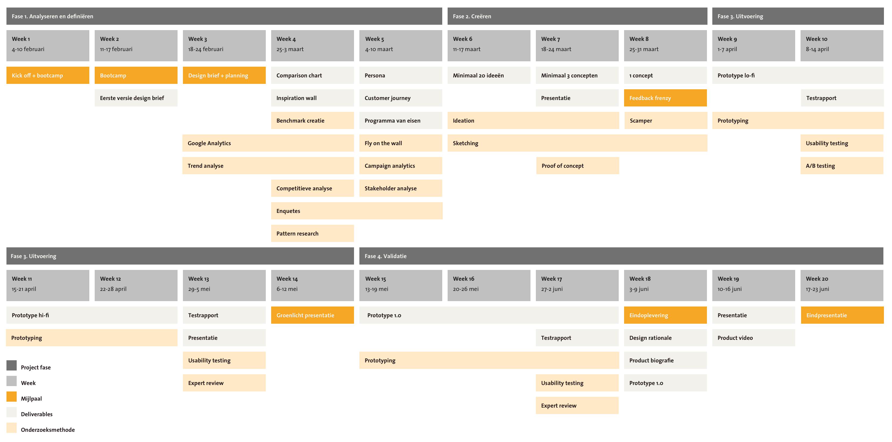

# 1.2 Planning

Om een duidelijk te krijgen wat ik de komende tijd zal opleveren heb ik de belangrijkste mijlpalen op een rij gezet. In de eerste paar weken zal ik mij bezig houden met de designbrief en planning. Vanaf week 4 zal ik werken naar een eerste concept zodat ik hier in week 8 feedback op kan ontvangen. Hierna zal ik het product gaan testen en iteraties maken zodat ik voor de indpresentatie een digitaal prototype kan opleveren. De “levende” planning is te vinden op [https://trello.com/b/JFWgx1Bc](https://trello.com/b/JFWgx1Bc). 

| **Belangrijkste mijlpalen** | **Datum** | Status |
| :--- | :--- | :--- |
| Inleveren design brief + planning | 18 februari | ✅  |
| Feedback Frenzy | 31 maart | ✅ |
| Groenlicht presentatie | 12 mei | 🔜 |
| eindoplevering | 9 juni | 🔜 |
| eindpresentatie | 23 juni | 🔜 |

