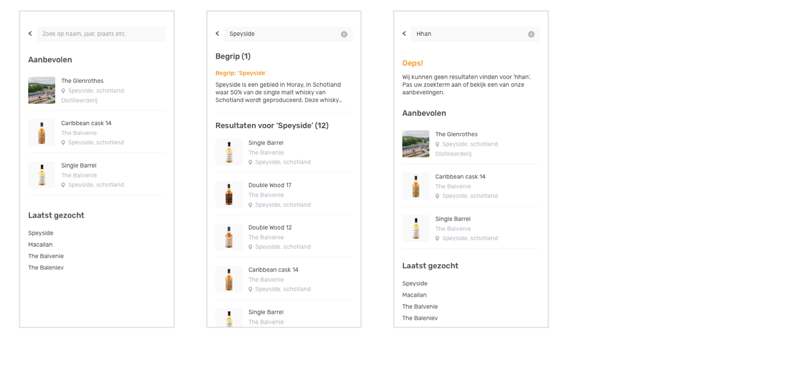

# Eindproduct

## De website 

Ik heb er voor gekozen om een mobiele website uit te werken omdat de gebruiker aan heeft gegeven vaak op zoek te gaan naar producten wanneer zij in aanraking komen met een nieuw product. Ook hebben zij in de enquete \(📝[Enquete, productbiografie](https://app.gitbook.com/@shelly-stoop/s/world-of-whisky/design-brief-en-planning/1.4-onderzoeksmethoden/enquete/enquete-resultaten-beginnende-whisky-drinker)\) aangeven dat zij naast thuis ook opzoek gaan naar informatie in de slijterij of op een evenement. 

Het product is in de periode tot het eindproduct twee keer getest. De eerste test heeft plaats gevonden met 4 testpersonen na het ontwerpen van een low-fi prototype. De uitkomst hiervan was dat de flow van de website nog niet duidelijk was en er te veel focus lag op de online tour. Daarnaast werden reviews en evenementen gemist en was er vraag naar een manier om de merken scanbaar te maken. Het idee om te focussen op beleving werd daarentegen wel gewaardeerd. Alle resultaten en conclusies van de eerste test zijn terug te vinden in mijn productbiografie bij test en resultaten.

📈 De testresultaten van het eerste prototype, kunt u terug vinden in het hoofdstuk '[Test en resultaten](https://app.gitbook.com/@shelly-stoop/s/world-of-whisky/fase-2-creeren/prototype-1.0/test-en-resultaten)' in mijn product biografie. 





Onderstaand zijn de uitwerkingen per onderdeel weergeven met daarbij de onderbouwingen en designkeuzes. 

### **1.0 Onboarding**

Als de gebruiker de webapp opent ziet hij als eerst het scherm met de leeftijd verificatie. Dit is verplicht bij iedere website die alcohol houdende middelen verkoopt of hiermee adverteert \(Ondernemersplein, z.d\). Als de gebruiker deze stap heeft voltooit begint de onboarding. 

Op het eerste scherm wordt uitgelegd wie World of Whisky is. Uit onderzoek is namelijk gebleken dat de gebruiker behoefte heeft aan transparantie wat betreft de eigenaar van de website \(💬[Gesprekken, productbiografie](https://app.gitbook.com/@shelly-stoop/s/world-of-whisky/fase-2-creeren/gesprekken-informatie-behoefte)\). De overige stappen van de onboarding gaan over de mogelijkheden/functies van de webapp. Dit zijn de dingen die World of Whisky onderscheidt van de rest van de websites. Namelijk, personalisatie, virtuele tours en de verhalen. 

### **2.0 Login en registreer**

Om de website meer gepersonaliseerd te maken heeft de gebruiker de keuze om zich aan te melden of te registreren. Dit is overigens niet verplicht maar zorgt er voor dat de gebruiker persoonlijke aanbiedingen en updates kan ontvangen. Dit scherm is te bereiken via 'mijn profiel' en zal zichtbaar worden op de momenten dat de gebruiker een functie wilt gebruiken die alleen toegankelijk is voor geregistreerde gebruikers. 

### **3.0 Home**

De homepagina is afhankelijk van of de gebruiker zich geregistreerd heeft of niet. Geregistreerde gebruikers krijgen berichten, producten en evenementen te zien die gericht zijn op de aangegeven voorkeuren en hun gedrag binnen de website. 

Als de gebruiker er voor kiest om zich niet aan te melden, zullen de updates op de homepagina afhankelijk zijn van populaire artikelen of evenementen. Daarnaast kan Maxxium zelf dingen pushen op de homepagina als zij willen dat dit onder de aandacht wordt gebracht bij gebruikers.

De homepagina is bedoeld om gebruikers te laten ontdekken en direct een reden te geven om verder te interacteren met de website. Doordat de content steeds wijzigt wanneer de site vernieuwd wordt, kan de gebruiker blijven ontdekken. 

### **4.0 Merken**

Op de merken pagina ziet de gebruiker alle merken uit het portfolio van Maxxium. De volgorde van de lijst kan gewijzigd worden naar populaire merken. Bovenaan de pagina staan de aanbevolen merken die op de voorkeuren en het gedrag van de gebruiker zijn afgestemd. 

### 5.0 Merk detail

Iedere merkpagina heeft een uitgelicht verhaal of tour beschikbaar. Deze content is afhankelijk van wat er interessant is voor het desbetreffende merk. Sommige merken zullen juist interessant zijn voor de virtuele tour en sommige hebben juist een verhaal die het merk bijzonder maakt.

Op de pagina kan de gebruiker wisselen tussen de algemene merk informatie en de producten. Omdat uit gesprekken met de doelgroep is gebleken dat veel begrippen op het oude platform niet begrepen werden \(💬[Gesprekken, productbiografie](https://app.gitbook.com/@shelly-stoop/s/world-of-whisky/fase-2-creeren/gesprekken-informatie-behoefte/huidige-informatie-vs-gewenste-informatie)\). Om dit op te lossen heb ik lastige begrippen uitklapbaar gemaakt. Als de gebruiker op het pijltje klikt klapt het begrip uit en komt er een korte toelichting.

### 6.0 Onze whisky's

Op de pagina onze whisky's kan de gebruiker een overzicht vinden van alle whisky's uit het portfolio van Maxxium. Uit de gebruikerstest is naar voren gekomen dat gebruikers graag een keuze willen hebben tussen een lijst weergave en een weergave met afbeeldingen \(📈[Test en resultaten, productbiografie](https://app.gitbook.com/@shelly-stoop/s/world-of-whisky/fase-2-creeren/prototype-3.0/test-en-resultaten-prototype-3.0)\). Daarom kan de gebruiker wisselen tussen de 2 soorten weergaven. Ook kan de gebruiker schakelen tussen de volgende volgorde weergaven: Alfabetische volgorde, best beoordeeld, prijs oplopend en prijs aflopend. Het filter kunt u wordt verder toegelicht bij 7.0 filter.    

### **7.0 Filter**

Het filter is beschikbaar bij de pagina 'onze whisky's'. De gebruiker kan filteren op soort whisky, merk, leeftijd, prijsklasse, smaken, alcohol en beoordeling. Daarnaast zijn er nog een aantal extra filter items die waarschijnlijk gebruikt zullen worden door meer ervaren whisky drinkers \(📈[Test en resultaten, productbiografie](https://app.gitbook.com/@shelly-stoop/s/world-of-whisky/fase-2-creeren/prototype-3.0/test-en-resultaten-prototype-3.0)\). Om deze reden zijn de laatste functies ingeklapt. Voor een aantal categorieën is er een informatie button beschikbaar. Deze is er om een toelichting te geven bij de titel. 

### 8.0 Product detail 

Op de detail pagina is alle informatie te vinden waar de doelgroep aangegeven heeft behoefte aan te hebben: een korte tekst over he product, soort whisky, land, regio, jaar, prijs en smaak. \(📝[Enquete, productbiografie](https://app.gitbook.com/@shelly-stoop/s/world-of-whisky/fase-2-creeren/enquete-informatie-behoefte)\) De smaaknotities zijn afgebeeld in een cirkel diagram omdat uit gesprekken met de doelgroep hier de voorkeur aan werd gegeven \(💬[Gesprekken, productbiografie](https://app.gitbook.com/@shelly-stoop/s/world-of-whisky/fase-2-creeren/gesprekken-informatie-behoefte)\) . Daarnaast kan de gebruiker reageren op producten en een beoordeling geven. 

### **9.0 Profiel** 

Omdat de content aangepast moet worden naar de voorkeuren van de gebruiker is er een profiel. Op het profiel van de gebruiker worden opgeslagen items zoals producten en evenementen weergeven. Daarnaast kan de gebruiker instellen welke producten hij interessant vindt zodat da aangeboden content hier op aangepast kan worden. Tot slot kan de gebruiker aangeven of hij meldingen wil ontvangen over de merken en soorten whisky van zijn voorkeur.

### 10.0 Verhalen

Bij de verhalen pagina komen alle bijzondere verhalen van mensen die betrokken zijn bij het proces van het maken van whisky. De doelgroep heeft aangegeven behoefte te hebben aan de verhalen achter whisky \(📝[Enquete, productbiografie](https://app.gitbook.com/@shelly-stoop/s/world-of-whisky/fase-2-creeren/enquete-informatie-behoefte)\) \(💬[Gesprekken, productbiografie](https://app.gitbook.com/@shelly-stoop/s/world-of-whisky/fase-2-creeren/gesprekken-informatie-behoefte)\). De verhalen hier kunnen gaan over hoe een specifiek product gemaakt is of juist een verhaal van iemand die een bijzondere beleving hebt met een product. Het voorbeeld dat ik heb genomen in mijn prototype is het verhaal van Andy Bowman. Andy Bowman is de designer van het Highland Park logo en vertelt waar zijn inspiratie vandaan komt. Op deze manier leren mensen op een leuke manier iets extra's over een merk of product. De gebruiker kan zelf kiezen of hij het verhaal wil lezen of bekijken.  

### 11.0 Virtuele tour

Om de gebruiker op een leuke manier kennis te maken met het proces binnen de verschillende distilleerderijen, kan de gebruiker een virtuele tour doen. Bij deze tour kan de gebruiker verschillende elementen in de tour aanklikken \(\)  en hier meer informatie over vinden. Uit gesprekken en enquetes met de doelgroep is naar voren gekomen dat de gebruikers meer willen zien over de distilleerderijen en hun processen \(📝[Enquete, productbiografie](https://app.gitbook.com/@shelly-stoop/s/world-of-whisky/fase-2-creeren/enquete-informatie-behoefte)\) \(💬[Gesprekken, productbiografie](https://app.gitbook.com/@shelly-stoop/s/world-of-whisky/fase-2-creeren/gesprekken-informatie-behoefte)\).



### **11.0 Evenementen**

Evenementen is een pagina die zowel vanuit de consument als uit Maxxium terug gezien wil worden op de website. Uit gesprekken met de doelgroep is gebleken dat de huidige website van World of Whisky te beperkt is wat betreft de evenementen \(💬[Gesprekken, productbiografie](https://app.gitbook.com/@shelly-stoop/s/world-of-whisky/fase-2-creeren/gesprekken-informatie-behoefte/huidige-informatie-vs-gewenste-informatie)\). De nieuwe pagina met evenementen is uitgebreid met meer informatie over het evenement en een directe knop naar de verkoop. Daarnaast is er een korte uitleg over voor wie de evenementen bedoeld zijn omdat de beginnend whisky drinker zich op de huidige website niet aangesproken voelde \(gesprekken, product biografie\). 

### 12.0 Kopen

In de oude vorm van World of Whisky was onduidelijk welk doel de site had en waarom er geen verkoop plaats vond op de website \(💬[Gesprekken, productbiografie](https://app.gitbook.com/@shelly-stoop/s/world-of-whisky/fase-2-creeren/gesprekken-informatie-behoefte/huidige-informatie-vs-gewenste-informatie)\). Bij ieder product is daarom nu een verkoop knop toegevoegd zodat de gebruiker door gelinkt wordt naar aangesloten retailers. Inde lijst met winkels worden alle grote verkoop adressen weergeven die op meerdere locaties zitten. Daarnaast kan de gebruiker een slijterij zoeken in de buurt. 

### 13.0 Zoeken

Op de site is nu een zoekfunctie beschikbaar. Op het huidige platform is geen zoekfunctie waardoor veel gerichte zoekopdrachten via een omweg gevonden moeten worden. Vanaf nu kan de gebruiker binnen één klik vinden waar hij op zoek naar is. Naast de reguliere zoekopdrachten kan de gebruiker ook begrippen zoeken. Het begrip wordt daarna direct uitgelegd in de resultaten zodat er geen klik naar een volgende pagina nodig is. Dit heb ik gedaan omdat de doelgroep heeft aan te geven veel onbekende begrippen tegen te komen op gelijknamige websites waardoor de teksten niet begrepen worden \(📝[Enquetes, productbiografie](https://app.gitbook.com/@shelly-stoop/s/world-of-whisky/design-brief-en-planning/1.4-onderzoeksmethoden/enquete/enquete-resultaten-beginnende-whisky-drinker)\).

### 14.0 Acties

Uit enquetes en gesprekken is naar voren gekomen dat de doelgroep behoefte heeft aan acties en aanbiedingen \(📝[Enquete, productbiografie](https://app.gitbook.com/@shelly-stoop/s/world-of-whisky/fase-2-creeren/enquete-informatie-behoefte)\). De gebruiker kan nu niet alleen zien welke producten er in de aanbieding zijn, maar ontvangt ook persoonlijke coupons.  

### 15.0 Over whisky

Ondanks dat overal op de website begrippen worden toegelicht en de pagina's ontworpen zijn om de gebruiker iets te leren, heb ik plaats gemaakt voor een plek waar alle informatie te vinden is over whisky. Informatie zoals het algemene proces en de soorten whisky zijn hier te vinden. 

Ik heb hier voor gekozen omdat de beginnende whisky drinker nog niet veel basis kennis heeft en er een algemene plek moet zijn om dit te kunnen vinden \(💬[Gesprekken, productbiografie](https://app.gitbook.com/@shelly-stoop/s/world-of-whisky/fase-2-creeren/gesprekken-informatie-behoefte/huidige-informatie-vs-gewenste-informatie)\). We willen de gebruiker het liefst zo veel mogelijk educatie bieden op het gebied van whisky. Dankzij de zoekfunctie kan de gebruiker gericht zoeken naar onderwerpen. 

### 16.0 Over ons

Op de pagina 'over ons' is een duidelijke uitleg over wie World of Whisky is en wat zij doen. Uit gesprekken met doelgroep is gebleken dat zij geen idee hadden van wie het huidige platform is en waarom er maar een beperkt aantal merken op staan \(💬[Gesprekken, productbiografie](https://app.gitbook.com/@shelly-stoop/s/world-of-whisky/fase-2-creeren/gesprekken-informatie-behoefte/huidige-informatie-vs-gewenste-informatie)\). Bij het nieuwe ontwerp wil ik de gebruiker transparantie geven over wie Maxxium is en wat zij doen.

### 17.0 Menu

Het product heeft een uitklapbaar menu omdat er te veel items in staan om een menu onderaan de pagina te hebben die altijd zichtbaar is. Notificaties worden in het menu weergeven. Het menu is niet uitklapbaar omdat de meeste categorieën meer dan tien sub items hebben en ik niet wil dat dit afleidt van de hoofd categorieën. 

## Bronnen

Ondernemersplan \(Z.d.\). Alcohol verkopen. Geraadpleegd op 2 juni 2019, van [https://ondernemersplein.kvk.nl/alcohol-verkopen/](https://ondernemersplein.kvk.nl/alcohol-verkopen/)

