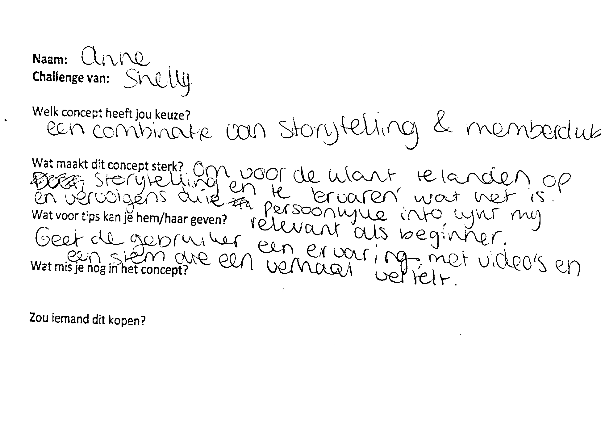

# Feedback Frenzy

Voor de Feedback Frenzy heb ik mij zoveel mogelijkl gefocust op mogelijke functies die aansluiten op de behoeftes van de gebruikers. Ook de manier waarop ik dit wil vertellen op de website speelt hierbij een belangrijke rol. 

Uit voorgaand onderzoek is gebleken dat de beginnende whisky drinker vooral behoefte heeft aan informatie en nieuwe producten. In de concepten wil ik hier zoveel mogelijk op inspelen om op een leuke manier de informatie tot de gebruiker te brengen. Omdat ik ook onderzoek heb gedaan naar de ervaren whisky drinker weet ik waaruit de interesse is ontstaan van deze groep. Dit heb ik zoveel mogelijk mee proberen te nemen om de beginnende gebruiker op dezelfde manier te inspireren. Hierbij gaat het vooral om de beleving die de gebruiker mee krijgt bij het product en niet per se de smaak. 

De concepten zijn voort gekomen uit de [schetsen]() die ik eerder in het proces heb gemaakt. 

Tijdens de presentatie heb ik proberen duidelijk te maken wat het probleem is en waarom ik precies op de beginnende whisky drinker wil inspelen en wie dit is. Daarnaast heb ik mijn drie concepten toegelicht. De drie concepten zijn iets meer gedetailleerd uitgewerkt omdat ik op deze manier voor mijzelf kan visualiseren hoe de functies tot uiting komen en of ik hierbij dingen over het hoofd zie. De schetsen zijn alleen een voorbeeld hoe het concept er uit zou kunnen zien en gaat vooral om de functionaliteiten.  





**Feedback Medestudenten, eerste en tweede lezer**

Tijdens de posterpresentatie hebben de medestudenten en beoordelende docenten feedback gegeven op mijn eerste concepten. Ik heb de feedback uitgeschreven zodat ik niet iedere keer als ik hier terug kom de handschriften hoef te ontcijferen. 

**Feedback van Denis** 

**Welk concept heeft jouw voorkeur?**   
Storytelling.  
**Wat maakt dit concept sterk?**   
Je kan hiermee de gebruiker een hele whisky beleving meegeven en tegerlijkertijd voorzien van informatie.   
**Wat voor tips kan je haar geven?**   
Misschien kan je ervaringen van ervaren whisky drinkers ook meenemen.  
**Wat mis je nog in het concept?**  
Een actie. Wat kan de gebruiker doen na de beleving en informatie.  
**Zou iemand dit kopen?**   
Voor whisky bedrijven kan het interessant zijn. Ik denk niet dat de gebruiker ervoor zou betalen. 

**Feedback van Anne** 

**Welk concept heeft jouw voorkeur?**   
Een combinatie van storytelling en memberclub.  
**Wat maakt dit concept sterk?**   
Om voor de klant te landen op storytelling en te ervaren wat het is en vervolgens de persoonlijke info lijkt mij relevant voor de beginner.  
**Wat voor tips kan je haar geven?**   
Geef de gebruikers een ervaring met video's en een stem die een verhaal vertelt. 

**Feedback van Sefania** 

**Welk concept heeft jouw voorkeur?**   
Storytelling.  
**Wat maakt dit concept sterk?**   
Een beleving geven aan de gebruiker. Als beginnende whisky drinker weet je vrij weinig van whisky en zo'n beleving lijkt me een goede intro om te beginnen.  
**Wat voor tips kan je haar geven?**   
Ook leuk als je reviews kan lezen en leren van experts  
**Zou iemand dit kopen?**   
Ja :\)

**Feedback van Onbekend \(Paul?\)**

**Welk concept heeft jouw voorkeur?**   
Combi  
**Wat maakt dit concept sterk?**   
Individu gericht.  
**Wat voor tips kan je haar geven?**   
Nieuwelingen hebben hulp nodig en moeten wegwijs gemaakt worden:  
- Hoe drink je?  
- Welke voor jou? Begin zacht.   
- Wetenswaardigheden algemeen  
- Wetenswaardigheden specifiek 

**Feedback van Wessel** 

**Welk concept heeft jouw voorkeur?**   
Membersclub.  
**Wat maakt dit concept sterk?**   
Omdat het meer persoonlijk is en dichter bij de interesses van de gebruiker.  
**Wat voor tips kan je haar geven?**   
Misschien kijken of je meer vrouwen er bij kunt betrekken?  
**Wat mis je nog in het concept?**  
Voor het ontdekken ook kunnen filteren op smaak of vat, waarop is het gerijpt. Je eigen smaakprofiel in kaart brengen.   
**Zou iemand dit kopen?**   
Ik denk uiteindelijk niet alleen beginnende whisky drinker maar ook ervaren whisky drinkers om hun smaakprofiel in kaart te brengen.

**Algemeen** 

"Vrouwen zijn een onderschatte doelgroep \(blijkbaar\)"   
- Wat hebben vrouwen hier nodig?  
- Wat vinden huidige gebruiksters? 

"Je noemde in de presentatie het samenspel van concept 1,2 en 3, de mix maakt een sterker geheel"

"Probeer een manier te vinden om aan te tonen waarom sommige whisky's duurder zijn dan andere, op een leuke manier!" 


De feedback komt er op neer dat een combinatie van concept 2 en 3 het sterkst zou zijn. Gebruik maken van storytelling en de gebruiker meenemen in het verhaal, maar daarnaast ook plek maken voor een eigen omgeving.   
  
Ook vrouwen zijn een onderbelichte doelgroep in de whisky wereld. Volgende stap om te onderzoeken of vrouwen behoefte hebben aan een plek waar zij terecht kunnen en wat is de reden dat vrouwen minder whisky drinken?  
  
Voor volgende week wil ik graag onderzoeken wat de specifieke informatie behoefte is bij de doelgroep. Dit ga ik doen door de doegroep te benaderen via een tweede enquete. 


