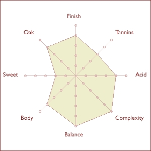

# Gesprekken informatie behoefte

Naast de enquetes heb ik veel gesprekken gevoerd met de doelgroep over welke informatie zij willen zien en op welke manier. Gesprekken heb ik gevoerd via skype met deelnemers van de enquete die aangegeven hebben in een later stadium nog maals mee te willen werken aan het onderzoek. Ook heb ik mensen gesproken in de whiskybar Zilt en L&B. Als laatste heb ik nog met vrienden/kennisen gezeten en gesproken over hun specifieke informatie behoefte. 

Om de gesprekken overzichtelijk te houden heb eerst gevraagd naar de algemene informatie behoefte en daarna deze geprobeert te specificeren. Ik heb in totaal 22 mensen gesproken. Alle resultaten zijn samengevoegd per vraag in plaats van de aparte resultaten. Niet alle vragen die ik terug heb gesteld zijn opgenomen in de resultaten. 

## Welke informatie verwacht de doelgroep \(beginnende whisky drinker\) terug te zien op een website? 

1. Met name benieuwd naar informatie over het product zelf zoals de prijs en de basis informatie; Basis informatie zoals waar het product vandaan komt en welke manier het gemaakt is \(het proces\). Daarnaast informatie over whisky zelf maar dan meer in de vorm van uitleg; op welke manier wordt whisky in het algemeen gemaakt en wat zegt de leeftijd over een product. Het liefst eerlijke en duidelijke informatie die ik begrijp. 
2. Hoe moet ik whisky drinken, welk glas voor welk soort whisky etc. Ik weet niks van de basics. Ik krijg van mijn broer elke verjaardag een fles whisky en andersom. Daarom wil ik graag weten wat de verschillen zijn en wat een goede whisky maakt. Dus het liefst wil ik weten wat goede flessen zijn voor een normale prijs. Of dingen waarvan ik weet dat ik ze lekker vind maar dan net iets anders.
3. Prijs, smaak enzo. Vooral de smaak. Ik hou niet van rokerig dus die hoef ik niet te kopen. Sommige smaken begrijp ik niet. Wat betekenen de smaken en hoe sterk zijn deze smaken. Een product kan rokerig zijn of een klein beetje rokerig. Dus niet alleen de smaak, maar ook in hoever de smaak zich uit. 
4. Verhalen van whisky. Ik vind mijzelf wel een beginnende whisky drinker maar denk dat ik mij iets meer ingelezen heb dan de meeste. Ik weet een klein beetje de basics van whisky maar drink het niet per se voor de smaak. Ik kan smaken niet onderscheiden maar vind het leuk om altijd een fles whisky thuis te hebben. Als er mensen zijn die er verstand van hebben vind ik het leuk als er een fles staat die of goed is of als er mensen zijn die er geen verstand van hebben dat ik er een leuk feitje over kan vertelllen. 
5. Smaaknotities van andere mensen. Het liefst ook met informatie die aangeeft hoe veel verstand iemand er van heeft. Ik koop liever een fles als ik weet dat mensen die ook nog weinig verstand van whisky hem hebben hem lekker vinden dan iemand die al 10 jaar whisky heeft. Ik vroeg ooit aan een vriend welke whisky ik MOEST hebben en kwam thuis met een whisky die veel te sterk was voor wat ik gewend ben. Smaken lopen dus best uiteeen. Liever een fles met een degelijke smaak en een mooi verhaaltje er achter. 
6. Bijzondere verhalen, processen \(hoe is het gemaakt en wat onderscheid zich van de rest van de merken. Bijzondere flessen vind ik leuker dan een fles die nou heel lekker is zonder dat er een verhaal aan zit. Imago vind ik belangrijk ja, als er iemand bij mij thuis komt wil ik niet alleen een Red label hebben staan want ik weet hoe mensen daar over denken. 
7. Informatie over hoe ik iets drink en welke smaak ik heb. Wil meer weten over wat toegankelijke whisky's zijn als je net begint. Welke whisky's zijn bedoeld om te mixen en welke niet. 
8. Type whisky: blend malt etc. Geen idee wat filtered enzo betekend en wat dat over een whisky zegt. Ik raak vooral het overzicht vaak kwijt. In een slijter vraag ik altijd om hulp en meestal; raak ik wel overtuigd door de verkoper omdat het een bijzondere fles is of juist op een goeie manier gemaakt is. Of het lekker of goed is zegt me daarbij eigenlijk niks. Verhalen, verhaal over het maken en het proces. Liefst niet te veel tekst. Ik kijk liever filmpjes op youtube etc. 
9. Alle informatie die mij kan helpen een goede keuze te maken. Er is te veel keuze en ik wil geen dom merk kopen. Heb het gevoel dat ervaren whisky drinkers daarop oordelen als ik iets slechts in de kast heb staan; Imago. 
10. Smaak en merk informatie. Zoveel keuze dus ik kijk eerder naar welk merk ik goed vind of goed schijnt te zijn en dan maakt het product mij niet zoveel uit als het maar betaalbaar is. Ik proef de verschillen niet. Als ik iets in een restaurant bestel zou ik niet kunnen zeggen of ik het goede product heb gekregen. Wil graag meer mijn smaak leren kennen of meer verstand krijgen van wat goede whisky is. Liefst zou ik iemand hebben aan wie ik dit soort vragen kan stellen. In de slijter voel ik me snel dom. De verkoper heeft het over de manier van stoken terwijl ik geen idee heb wat dat betekend. Ga ik daar dan 20 euro extra voor geven? Iemand kan mij alles verkopen omdat ik er te weinig verstand van heb. Wil dit liever zelf kunnen beslissen op basis van eigen kennis en ervaring. 
11. Ik koop veelal wat vrienden kopen en kijk naar welke merken in de aanbieding zijn of goed zijn. Informatie over de smaak wil ik zien en informatie over het merk. Zijn ze goed, awards? Ik heb ook voorkeur voor kleinere distilleerderijen waarbij alles handgemaakt is in plaats van grote distillerderijen waar het ambacht verdwenen is. 
12. Basis kennis over whisky die mij kan helpen bij het kopen van een product. Langzaam meer kennis opdoen over de smaak. Ik kan moeilijk alles proberen dus misschien kan ik met behulp van andermans meningen alvast dingen uitsluiten. Daarnaast om mijn smaak te ontwikkelen graag meer info over evenementen of proeverijen doe ik kan doen.  
13. ALLES. Ik wil alles weten voor ik een product koop. Niet per se smaak eerlijk gezegd omdat ik het leuk vind dingen te proberen. De ene keer drinkt iets makkelijk weg en de andere keer niet. Smaken onderscheiden niet goed in. Beniieuwd naar verhalen. Ga daarom juist vaak naar fysieke winkels om overtuigd te worden. Geef mij alle informatie of ervaringen die het voor mij leuk maken om een product te kopen. Als ik dit dan drink met huisgenoten is het niet zomaar een whisky maar vertel ik vaak over wat de slijter over het flessie zegt. Sommige mensen kunnen het gewoon mooi vertellen. Ik wil dat als ik iemand met ervaring een glaasje geef dat iedereen zijn eigen verhaal heeft met het product. Dus het liefst wil ik weten wat bijzondere en toegankelijke merken zijn. 
14. Informatie over distilleerderij. Prijs en proces. 
15. Verhalen zoals je ze bij een proeverij krijgt. Alleen hierdoor ben ik overtuigd. Als ik alle merken op drankdozijn zie zie ik door de bomen het bos neit meer. Wat is lekker wat niet? Welke hoef is sowieso niet en wat is in de aanbieding.
16. Ik zou wel meer willen weten over merken en daarna basseer ik of ik daar een fles van ga kopen. Ieder product opzich bekijken is te veel werk. Dus overtuig me eerst van een distilleerderij en daarna pas de product keuze.  
17. Alle informatie die nodig is voor het kopen van een product.Zoals, streek, merk, prijs, reviews en basic productinfo: welk vat, wat is de smaak etc. Beleving van een product is naar mijn mening het belangrijkst. Wat kan ik andere over het product vertellen. 
18. Informatie over het product, informatie over prijs, smaak, afkomst, jaartal etc. Maar wel op een manier die ik begrijp. 
19. Eerlijk gezegd kijk ik nooit naar een jaartal of waar een product vandaan komt. Meestal zoek ik iets uit op het etiket of omdat ik de fles er mooi uit vind zien. Vraag mij af hoe andere het doen want als ik op zoek ga naar een fles die 12 jaar oud is bestaan er wel 10000en. Hoe ga ik hier ooit een keuze tussen maken. Voor mij is het dus prijs afwegen tegen een mooie fles en daarna ga ik mij  verdiepen in de smaak, niet andersom. 
20. Vooral smaak en reviews. Dan wel alleen bij bekende merken om de keuze wat te beperken. een vriend van mij vertelt bijvoorbeeld over Talisker en dan ga ik daar in verdiepen. Wt voor soort whisky is het en waarom vinden mensen dit nou zo lekker. 
21. Alles wat een fles bijzonder maakt, en onderscheid van de rest. Liefst geen basic flesjes zoals JD die iedereen wel kent. 


Mensen geven vooral aan dat het niet per se om de smaak gaat op de eerste plaats maar vooral om het uiterlijk, verhaal of imago van een fles. Daarnaast moet de informatie de gebruiker vooral overtuigen van waarom een product bijzonder is en beter is te opzichte van andere producten. 

Gebruikers beginnen vooral met het verdiepen in een distilleerderij en gaan daarna pas opzoek naar een product. Vervolgens komt dan pas het orienteren op smaak. 

Belangrijk zijn de toelichtingen bij smaak en moeilijke begrippen zodat mensen kunnen leren over wat bijvoorbeeld het proces is. 

Relevant wat het niveau van iemand is die het product adviseert. Voor de een is het sterk maar voor de ander niet. 


## Op welke manier wil je smaaknotities terug zien op de website? 

Ik heb eerst de vraag gesteld zonder visualisaties er bij en vervolgens een aantal voorbeelden voorgelegd om de gebruiker het zich beter voor te kunnen laten stellen. 

1. Combinatie tussen iconen zoals whiskywise en de hoeveelheid van de smaak. 
2. Plaatjes of een diagram 
3. Maakt niet uit als het maar duidelijk is. 
4. Iconen met uitleg. 
5. Liefst door middel van tekst denk ik.
6. Ik wil weten door wie de smaak notities zijn geschreven, het merk? De site? Bezoekers? 
7. Combinatie van plaatjes en of tekst
8. Plaatjes
9. Diagrammen 
10. Zoals bij whiskybase en zelf ook kunnen aangeven welke smaken je herkent. 
11. Tekst gewoon. Plaatjes lijkt me niet echt duidelijk. Of een schaal die ze ook gebruiken bij Wijn. Alleen dan natuurlijk voor de dingen die bij whisky interessant zijn. 
12. Tags of een circel met de waardes per smaak er in. Dat maakt de keuze alleen wel beperkter. De reden dat het vaak in tekst gedaan wordt is omdat je dan meer vrijheid hebt dan met iconen. 
13. De normale smaken in tekst plaatjes etc. maakt mij niet uit als het maar duidelijk wordt. Liefst zou ik er bij zien door wie dat bedacht is en of iemand ervaring heeft of niet. 
14. Smaken met uitleg
15. SMaaknotities ook bij de recensies. Alleen een recensie als 'goede whisky' heeft niemand iets aan.
16. Tekst
17. Tekst en kleur combinatie, extra iconen
18. Tegenstellingen en dan de hoeveelheid zacht - rijk, gedroogs fruit, - vers fruit
19. Tekstueel of plaatjes van smaken
20. Maakt niet uit 
21. Zolang het duidelijk is geen voorkeur. Wel overzichtelijke weergaven dus niet in hele volzinnen. 
22. Meteen scanbaar maken, eventueel vergelijken.  
23. Diagram
24. Diagram
25. Optie 3 
26. Tekst en visueel

