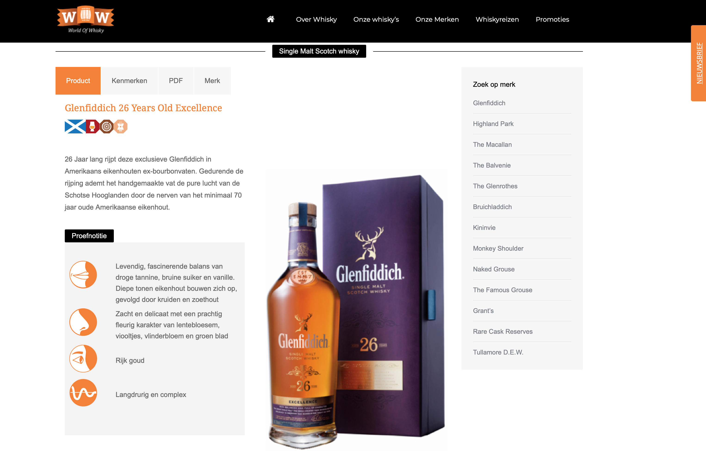
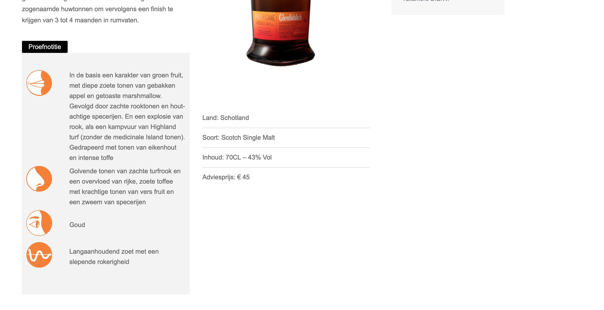

# Huidige informatie vs gewenste informatie

Uit gesprekken en enquetes blijkt dat de doelgroep behoefte heeft aan informatie. Deze specifieke behoefte is vastgesteld in voorgaand onderzoek. Omdat het huidige platform gestart is met het idee om de gebruiker te informeren is er ergens een reden voor dat de huidige informatie niet aansluit bij de informatie behoefte van de gebruiker. Deze redenen zal ik verder toelichten in dit hoofdstuk.  

Alle informatie die hier onder beschreven is, is voortgekomen uit gesprekken met de doelgroep. Deze mensen heb ik gesproken in whiskybar L&B en mensen met wie ik contact heb gehad via skype omdat zij toestemming gegeven hadden bij de enquetes om hen te benaderen. Hier heb ik algemene gesprekken gevoerd over wat er verwacht werd op de website en wat hun mening is over de huidige website. Deze geprekken zijn terug te lezen bij het hoofdstuk gesprekken en fly on the wall. 

## 1. Transparante informatie

Uit gesprekken met de doelgroep blijkt dat zij transparantie missen als het gaat om het huidige platform. Er is behoefte aan informatie over de eigenaar van het platform. Het gebrek aan deze informatie roept vragen op bij de gebruikers. Waarom zouden zij de informatie van dit platform halen en is de informatie die hier staat juist? Er zijn maar een aantal merken die aan bod komen op het platform, wat niet erg is, maar wel als er niet gecommuniceerd wordt naar de doelgroep waarom dit is. 

## 2. Vindbaarheid van informatie

Als de behoefte van gebruikers is om informatie over een product te vinden, moet er wel een manier zijn om op de website informatie te vinden. Op dit moment kan dat alleen via het menu of via direct search via Google. Er mist een zoekbalk die het makkelijk maakt voor de gebruiker om direct te navigeren naar waar hij naar opzoek is. Een werknemer van Maxxium geeft aan dat deze bewust is weg gelaten zodat niet alle pagina's bereikbaar zijn. Waarschijnlijk zijn dit verouderde pagina's of pagina's die ingezet zijn voor SEO maar waar ze liever geen gebruikers naar toe navigeren. 

##  3. Prijs informatie

Prijs informatie is een belangrijke behoefte vanuit de doelgroep. 30% van de ondervraagden zou tot 60 euro uitgeven aan een fles. Dit komt voornamelijk omdat de doelgroep nog onvoldoende een eigen smaakprofiel heeft ontwikkelt. Als je kijkt op het huidige World of Whisky platform zie je dat de producten beginnen bij de duurste/exclusievere producten. Het eerste product heeft een adviesprijs van 5000 euro. Dit schrikt de beginnende whisky drinker af omdat dit absoluut niet is wat zij gaan aanschaffen. Het prijsfilter aan de zijkant is standaard ingeklapt waardoor het niet opvalt naast de uitgeklapte filters. 

## 4. Product informatie 

Product informatie is niet consistent als het gaat om vanuit wie de tekst is geschreven. Veel tekst wordt vanuit ons \(Maxxium\) geschreven en andere informatie juist in de zij vorm. De teksten worden veelal gekopieerd vanuit het engels waardoor er teksten ontstaan die in het Nederlands minder sterk overkomen. Personeel van Maxxium ziet op dit moment nog niet de waarde in van hoe belangrijk zo'n tekst is om de gebruiker te binden met het merk of product. Zoals uit de gesprekken al bleek hebben mensen weinig motivatie om het huidige platform te onderhouden omdat er zo weinig bezoekers op het platform komen. De gedachte zou hier juist andersom moeten zijn; meer moeite doen zodat er juist méér mensen op het platform komen.

Naast dat informatie niet up to date is of weinig aandacht aan besteed is, is de informatie ook niet toegespitst op de gewenste doelgroep; de beginnende whisky drinker. De begrippen in de tekst zijn onduidelijk en geven weinig relevante informatie. Vragen als 'waarom zou ik deze whisky kiezen?' of 'wat maakt deze whisky bijzonder?' worden nergens beantwoord. Overal wordt gesproken over bijzondere verhalen die achter een product zitten maar nergens op de website komen deze terug. 

De details over een fles zoals filtratie, vat soort en finish van de whisky zeggen iemand die net whisky drinkt niet zo veel maar er is ook geen plek op de website waar de gebruiker deze informatie kan vinden. 

De product informatie is het grootste probleem omdat de gebruiker hier juist getriggerd of overgehaald moet worden om zich te interesseren voor een product. Alleen informatie over de smaak van een product gaat de gebruiker niet over de streep trekken. 

Bij bovenstaande afbeelding is te zien hoe kort de informatie tekst is. Het gaat hier om een product van 419 euro. Een beginnende whisky drinker gaat niet leren waar het verschil zit in een duurdere whisky als dit nergens beschreven staat. Wat zegt de leeftijd over het product?, waarom is de ene whisky duurder ten opzichte van de andere? Willen we de beginnende whisky meer kennis geven moet basis informatie aangeboden worden op een manier die zij interessant vinden en ook begrijpen. 

## 5. Smaaknotities

Smaaknotities of proefnotities worden nu uitgebeeld in iconen en tekst. Op onderstaande afbeelding is te zien welke afbeeldingen ze gebruiken. Smaak en geur spreken wellicht voor zichzelf maar de andere 2 iconen hebben voor de doelgroep meer toelichting nodig. De laatste wordt door niemand van de doelgroep begrepen. Vanuit de doelgroep krijg ik te horen dat er behoefte is om te weten hoe 'sterk' het product is. De vergelijking met bier wordt gemaakt. Hier is het duidelijk dat de opbouw van pils, blond, ipa naar donker en bokbier is. Terwijl bij whisky is het meer gissen naar of de smaken licht en toegankelijk zijn voor iemand die net whisky drinkt. Wellicht moet er dus bij de smaak notities meer toelichting komen bij de smaken en iconen. daarnaast toelichtingen op de dingen naast smaak, wat zegt geur over een whisky of wat kan ik uit de kleur opmaken. Daarnaast is dit een eenzijdig beeld van de smaak, wat vinden andere van de fles. Meerdere meningen over de smaak kunnen helpen bij een keuze \(reviews\).

## 6. Verkoop informatie

De gebruiker heeft is overtuigd van een product en besluit deze aan te schaffen, en nu? Nergens staat informatie over waar het desbetreffende product gekocht kan worden. Weer ontstaat er verwarring want wat is dit voor website dan? Het gevolg hiervan is dat de gebruiker zelf via Google het product gaat opzoeken. Het eerste resultaat op Google is drankgigant of drankdozijn. Dit betekend je in de hele customer journey aanwezig bent geweest tot het moment van aankoop. Oftewel, alle marketing is gedaan en de consument koopt het product uiteindelijk bij een niet aangesloten retailer. Uiteraard ontkom je er niet aan dat gebruikers bij een website kopen die goedkoper lijkt, maar we moeten het de gebruiker niet te makkelijk maken om dit te doen.  

## 7. Evenementen

Voor Maxxium is het belangrijk dat er evenementen op de website staan omdat veel evenementen door hen of interne medewerkers worden georganiseerd. Als ik mensen vraag om te zoeken naar evenementen duurt het lang dat dit gevonden wordt. Dit komt door de naam proefkalender. Deze naam is duidelijk als je eenmaal weet waar je het moet vinden. De doelgroep lijkt het interessant om naar evenementen te gaan maar op dit moment is het niet duidelijk waar zij meer informatie kunnen vinden over de evenementen. Niet overal staan linkjes naar websites. Ook wordt aangeven dat het onduidelijk is voor wie de whisky evenementen zijn. Is het besloten of een evenement? Moet ik mij aanmelden of kaarten kopen? Informatie per evenement is verdeeld en de gebruiker wordt niet overtuigt dat de evenementen zijn voor hem als beginnende whisky drinker. 

Los van de gebruikers maar wel een belangrijk ding: doordat informatie over evenementen op andere plekken dan de website van World of Whisky wordt gezet, is er geen inzicht in online data. Welke evenementen vinden gebruikers interessant, hoeveel mensen hebben zich aangemeld via World of Whisky? Deze dingen kunnen nuttig zijn voor evenementen in het vervolg. 

Note: Link naar whisky van de maand slijterijen op event pagina \(bestaat niet meer\) 

