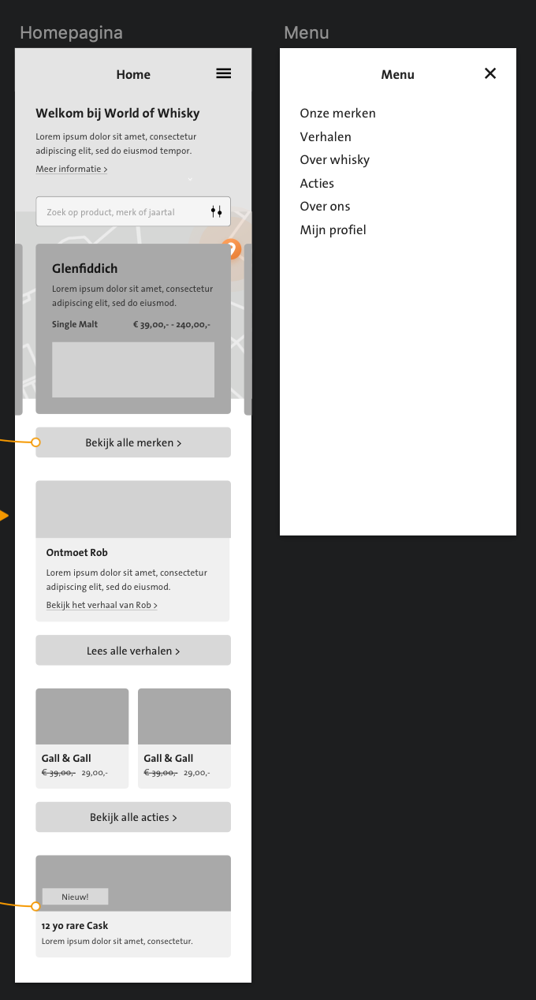
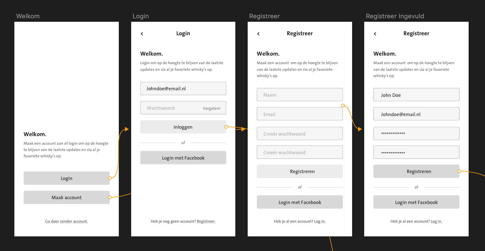
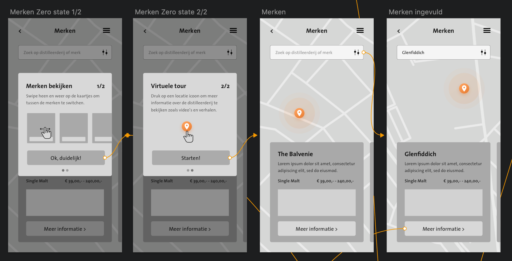
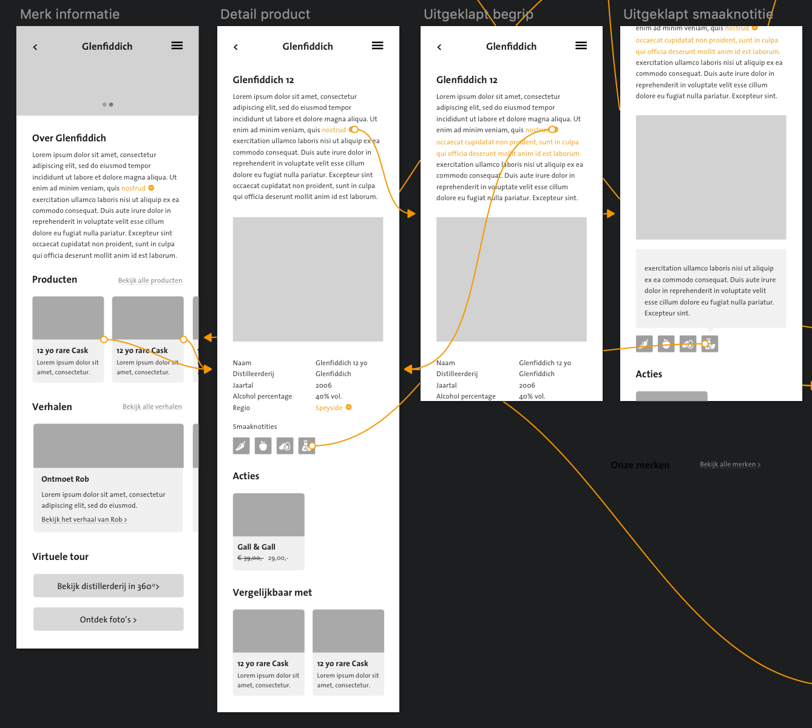

# Prototype 1.0

**1.0 Homepagina**

Voor de homepagina heb ik een pagina gemaakt met als eerste proriteit een ingang naar de merken omdat dit het meest relevante onderdeel voor de gebruiker is. Daarna een verhaal om de homepagina iets interessanter te maken en de gebruiker te binden aan een van de merken. De acties heb ik een prominente plek gegeven op de homepagina omdat dit is wat de bezoekers triggert om een product te bekijken. 

**2.0 Login**

De ****gebruiker is niet verplicht om in te loggen maar dit is wel handig als hij updates wilt ontvangen of zijn voorkeuren aanpassen. Naast de normale inlog kan de gebruiker er voor kiezen om met Facebook in te loggen. Zonder inlog is er geen personalisatie. Dit scherm is bereikbaar via 'mijn profiel' en is niet zoals een app het start scherm. 

**3.0 Merken**

Bij de merken kan de gebruiker door de merken heen swipen en de pin op de kaart veranderd automatisch van positie. het is de bedoeling dat er meer informatie komt als de gebruiker op 'meer informatie' klikt. Als de gebruiker direct op de pin op de kaart klikt, zal hij foto's en een 360 graden afbeelding van de locatie zien. Bij elk merk staat vermeld wat voor soort whisky het is en wat de prijs klasse is. 

**4.0 Merk detail**

Onder merk detail zijn ingangen naar verschillende functies zoals de verhalen en producten. Vooral de producten zijn hier belangrijk en de informatie over het merk. Alle begrippen die lastig zijn, zijn gemarkeerd en kunnen uitgeklapt worden. Smaaknoties zijn uitgelegd voor degene die niet exact weten wat er mee bedoeld wordt. 

Gerelateerde producten zijn bedoelt voor mensen die iets zoeken wat bij hun smaak past maar toch op zoek zijn naar een ander soort product.

~~**Link naar prototype:**~~

**Prototype is verwijderd omdat de gratis versie van invision maar 1 werkend prototype toe laat.** 





