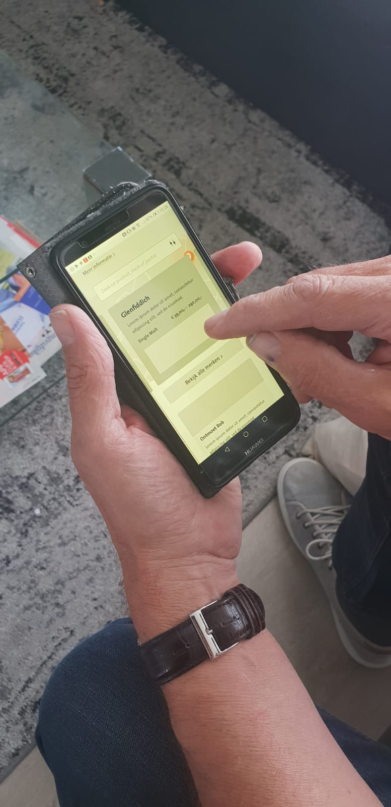

# Test en resultaten

Het eerste lo-fi prototype heb ik getest met 3 testpersonen. Meer informatie over de testpersonen staat bij de de onderstaande testresultaten. Deze eerste test is bedoeld om feedback te krijgen op het concept en de functies. Deze testresultaten neem ik mee in het prototype 2.0. De test is gedaan met het Invision prototype van prototype 1.0.

Voor de test heb ik een aantal vragen opgestelt welke de gebruiker zal doorlopen middels de test. Na de test heb ik samen met de testpersonen nog gebrainstormt over welke functies ik kan schrappen en toevoegen. 

## De vragen

1. Je hebt te horen gekregen dat Glenfiddich een nieuw product op de markt heeft gebracht, namelijk Glenfiddich 12, en wilt hier graag meer informatie over, hoe doe je dit? 
2. Je bent benieuwd naar de omgeving van de Glenfiddich distilleerderij, waar ga je heen om dit te bekijken? 
3. Je wilt de smaak van de Glenfiddich 12 weten, waar zoek je dit? 
4. Je bent opzoek naar een specifieke whisky uit het jaar 2000, waar zoek je dit? 
5. Je bent alleen geinteresseerd in whisky's onder de 30 euro, hoe zoek je dit? 
6. Je hebt gehoord over de speyside regio en bent benieuwd wat hier kenmerkend aan is, hoe ga je hier naar op zoek?
7. Je bent zoekende naar wat voor product je zal kopen en wilt graag een overzicht van alle merken, hoe doe je dit?

## Test 1: Geert 

Geert is 24 jaar en drinkt ongeveer 1 tot 4 keer per maand whisky. Hij drinkt vooral zachte whisky's en heeft nog niet heel veel verstand van welke soorten er bestaan. Hij is met name benieuwd naar de smaken van whisky's en hoopt dat hij kan vinden welke smaak bij hem past. 

Maakt meteen gebruik van de zoekbalk op het hoofdscherm. "ben ik er al, welke informatie moet ik zoeken". Hij gaat er vanuit dat hem om het lange stuk tekst over het merk gaat. Omdat hij niet meer weet hoe het product heeft twijfelt hij welke hij aan moet klikken. Uiteindelijk klikt hij de juiste aan. Verwacht meer boven aan de pagina de product details en de foto helemaal boven aan. Kijkt namelijk vaak naar de fles en vorm. 

1. Is dit al tegengekomen bij vorige vraag, gaat direct naar de foto's en 360 tour. 
2. Bij de informatie die hij bij vraag 1 ook al gezocht had, alleen navigeert hij nu via merken in het menu. 
3. Gaat naar home en gebruikt zoekbalk. Vraagt zich wel af of hij moet zoeken op 18 jaar oud of jaar 2000. Hier heb ik nog niet over na gedacht maar dit zou allebei moeten kunnen. 
4. WIl bij merken op volgorde selecteren zoals dat ook in webshops gaat: prijs - hoog -laag. Deze zou nu onder filter moeten zitten maar moet misschien een duidelijkere plek hebben. 
5. Zou filter of zoekbalk gebruiken. 
6. Via menu naar merken. 
7. Algemeen: Home staat niet in de navigatie en hij mist de reviews bij een product. Mist ook evenementen. \( deze moeten er in principe ook inkomen vanuit Maxxium dus toevoegen!\) 

## Test 2: Tijmen

Tijmen is 22 en drinkt af en toe whisky. Hij houdt meer van bier maar drinkt wel eens een glas mee met zijn vrienden. Hij gebruikt op dit moment geen websites behalve voor de verkoop. Als hij iets koopt is het een kado en heeft dan behoefte aan meer informatie over een product en aanbiedingen.

Bekijkt eerst even de hele homepagina en drukt op Glenfiddich. Daarna gaat hij direct naar producten. 

1. Vanaf de home valt hem het kaartje op en vraagt zich af of die klikbaar is. Je ziet wel iets maar er is te weinig ruimte om te kunnen klikken &gt; verwarrend. Kan het niet helemaal goed vinden omdat hij zoekt naar foto's en video's. 
2. Direct gevonden. Vraagt zich af of dit alle smaken zijn die kunnen of alle smaken die gelden voor glenfiddich 12. Optie om ergens alle smaken die bestaan te kunnen vinden \(in filter?\).
3. Via het filter in de zoekbalk bij merken. 
4. Ook via het filter. 
5. Zoekt bij 'over whisky'.
6. Gaat direct naar merken. Nog onduidelijk dat je kan swipen maar dat kan liggen aan het prototype. Wel handig met de uitleg alleen zou hij niet nog het kaartje ook klikbaar maken, of dit duidelijk aangeven. Snapt niet goed waar dat heen gaat. 
7. Algemeen: Leuk concept alleen ik zou de rondleiding visueel maken en niet als button. 

## Test 3: Peter

Peter is 47 jaar en is ook beginnend whisky drinker. Hij drinkt voornamelijk thuis en heeft net de stap gemaakt van gemixte whiksky naar puur. Gebruikt websites vrijwel nooit en gaat liever naar de slijter omdat daar meer info te behalen valt. 

1. Duurt iets langer maar heeft hem gevonden via de homepagina. Vewacht nieuwe producten boven aan de pagina. 
2. Kan dit niet vinden, pas na mijn hulp gevonden. 
3. Gaat weer via nieuw product op de homepagina naar info en ziet het daar. 
4. WIl bij merken zoeken maar daar staat alleen op destilleerderij zoeken. Op de homepagina kan het wel via de zoekbalk, waarom is dat anders? 
5. Weet hij niet, het filter valt hem niet op en weet niet of hij de zoekterm onder 30 kan invullen.
6. Gevonden via zoekbalk. 
7. Merken via menu, vind het niet duidelijk genoeg dat hij kan swipen en duurt langer voor zijn gevoel. Niet makkelijk als je wilt scannen.
8. Algemeen: De zoekbalk op de homepage is verwarrend omdat het niet duidelijk is of hij filtert op alles op de pagina of alleen zoals bij merken. 

## Test 4. Guus

Guus is 25 jaar en beginnend whisky drinker. Hij drinkt 1 keer per maand of minder whisky. Hij koopt whisky meestal bij zijn favoriete slijterij ton overmars op het Hoofddorpplein. Meestal geeft hij rond de 30 tot 40 euro voor een fles uit. 

1. Gebruikt de zoekfunctie. 
2. Kan dit niet vinden, pas na mijn hulp gevonden. 
3. Gaat weer via de zoekbalk op de homepagina.  
4. Zoekbalk. 
5. Verwacht een sorteer optie. 
6. Gevonden via zoekbalk. 
7. Merken via menu, wilt naar beneden vegen. 
8. Algemeen: Beetje onoverzichtelijk en niet heel persoonlijk. Wil gewoon een duidelijke lijst en een iets leukere weergave. Als het gaat om personalisatie is het lastig te zien met zo'n prototype. Tip om het gewoon uit te werken en meer te doen met video's. 

1. 

1. 2. 
