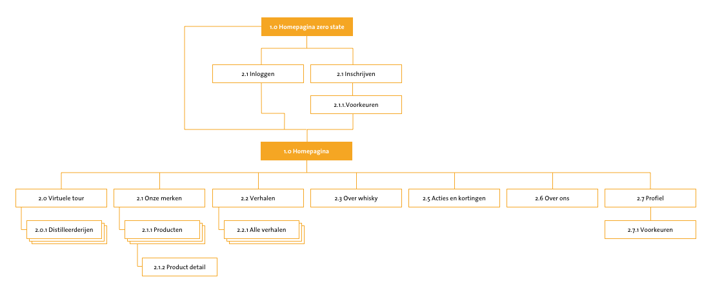

# Sitemap

Uit voorgaand onderzoek heb ik de functies vastgestelt die het product moet hebben. De sitemap heb ik gemaakt om voor mijzelf duidelijk te krijgen welke pagina's ik moet schetsen en op welk niveau de functies zich bevinden. 

#### Inloggen/ registreren

Het inlogscherm is er voor bedoeld om de gebruiker de mogelijkheid te geven om de voorkeuren op de website aan te passen. Hier kan de gebruiker aangeven over welke merken hij wel of geen nieuws wilt ontvangen. Als iemand niet geinteresseerd is in pushberichten over nieuwe artikelen kan hij dit aan of uit zetten. Als de gebruiker wel pushberichten wil ontvangen kan hij de merken in en uit schakelen voor deze functie.  

#### Homepagina

De homepagina moet het moment zijn waar de gebruiker direct snapt op welke site hij is en voor welke informatie hij hier terecht kan. Op dit moment is het onduidelijk waarom er maar een aantal merken worden weergeven. Hier moet een korte introductie staan over waarom er maar een aantal merken aan bod komen en welke voordelen dit heeft. Namelijk, gespecialiseerd in een beperkt aantal merken waardoor de kennis hiervan juist maximaal is. Op de homepagina moet de gebruiker direct getriggerd worden om een van 

#### **Virtuele tour** 

Met de virtuele tour kan de gebruiker op een visuele manier meer te weten te komen over de merken/ distilleerderijen. Alle informatie over de distilleerderijen zal visueel en tekstueel gemaakt worden zodat mensen een beeld krijgen van het proces en de verschillen tussen regio's en merken. 

#### **Verhalen**

Uit enquetes en gesprekken is gebleken dat mensen vooral benieuwd zijn naar de verhalen achter een product. Dit kunnen verhalen zijn over het merk of een bijzondere manier waarop een soort geproduceerd is. Ik wil graag verhalen in kaart brengen van mensen die betrokken zijn geweest bij het maken van een product om het levendiger en persoonlijker te maken. Hier ligt de focus vooral op beleving. 

#### **Over whisky** 

Om mensen te helpen bij het maken van goede keuzes moeten mensen enige basis kennis hebben waarop ze hun koop kunnen baseren. Deze kennis is bijvoorbeeld het verschil tussen de blends en single malts of het verschil in smaak tussen de verschillende regio's. Deze informatie moet geschreven zijn op een toegankelijke manier voor de beginnende whisky drinkers. 

#### Acties en kortingen

Uit enquetes is gebleken dat gebruikers behoefte hebben aan acties en kortingen van producten. Aangezien Maxxium inzicht heeft in de promoties, kunnen zij relevante acties op de website plaatsen. Als bijvoorbeeld Gall & Gall een actie heeft wordt dit vermeld en krijgen de mensen die hier interesse in hebben een pushbericht. 

#### **Over ons** 

Zoals bovernstaand als is vermeld is het onduidelijk welk doel de pagina heeft en waarom er een beperkt aantal merken op staan. Hier moet Maxxium transparant over zijn en zich posititioneren als expert van de merken die zij wel op het platform hebben staan. 

#### Profiel 

Via het profiel kun je inloggen of registreren en je voorkeuren aanpassen. 

#### **Producten**

Onder producten zijn alle producten per merk te vinden. 

#### Productdetail

Alle informatie over de prodcuten, namelijk: Smaaknotities, land van herkomst, regio, jaartal, merk en vat. 

