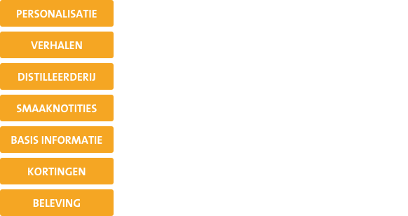

# Unique selling points

Er bestaan al een aantal websites in de whisky markt die zowel informatie als producten aanbieden aan consumenten. Op dit moment zie ik nog geen concrete mogelijkheden voor Maxxium om zelf producten te verkopen op vaste basis via de website. Omdat zij officieel importeur zijn, zou hier te veel weerstand komen van de bedrijven bij wie zij nu inkopen. Maxxium kan producten voor een lager tarief aanbieden als zij dit zelf zouden doen maar dat zou wel ten koste gaan van de verkoop bij vestigingen van bijvoorbeeld Gall & Gall. Naar mijn mening zou Maxxium loyaal moeten zijn aan de inkopers en alleen in enkele gevallen gebruik maken van verkoop. 

Als Maxxium zich niet kan of mag inzetten voor het verkopen van whisky producten, op welke manier kunnen zij zich dan onderscheiden van de rest van de whisky websites?

Uit het onderzoek bleek al welke punten World of Whisky heeft die concerrenten niet hebben. Nu ik verder ben in het proces vraag ik mij af of deze specifieke functies wel de juiste elementen zijn om naar te kijken. Tot nu toe is nergens uit gebleken dat dit de dingen zijn waar gebruikers behoefte aan hebben. Daarom ben ik opnieuw gaan kijken naar concurrerende websites en hoe deze aansluiten bij de behoefte van de gebruikers. De informatie behoefte is gebleken uit enquete 1 en 2. 




Uit mijn analyse blijkt dat in veel gevallen online websites inspelen op verkoop of juist het geven van informatie. Het ontbreekt voornamelijk aan overzichtelijke en consistente opmaak van product informatie. 

Uit mijn tweede enquete blijkt dat gebruikers voornamelijk behoefte hebben aan de basis informatie zoals smaaknotities, land van herkomst en prijs. Daarnaast zijn zij geinteresseerd in informatie over de destilleerderijen, verhalen van makers en productie, iets wat bij bovenstaande websites nauwelijks aangeraakt wordt. 


De informatie behoefte van de gebruikers is vooral gebasseerd op informatie die gaat over de producten zelf. Namelijk: land van herkomst, regio, productie, prijs, jaartal, soort en vattype. Naast deze informatie is er behoefte aan informatie over de achtergrond van het product, namelijk: Geschiedenis destilleerderij, algemeen destilleerderij en verhalen achter de makers.

Gebruikers geven aan informatie te willen wanneer zij een product aanschaffen of wanneer zij getriggerd worden door een product en hier meer informatie over willen. Dit betekend dat er veel kansen liggen bij de website voor de gerichte bezoeker. Deze bezoekers komen hoogst waarschijnlijk binnen via Google op het moment dat zij een zoekterm intypen. Op dat moment moet World of Whisky het platform zijn die de gebruiker alle informatie kan geven waar de gebruiker op dat moment behoefte aan heeft. Voor Maxxium is het verstrekken van deze informatie niet moeilijk omdat zij direct contact hebben met de merken, in tegenstelling tot bovengenoemde partijen. Dit wil zeggen dat Maxxium de eerste is die informatie heeft over de whiskyproducten in hun assortiment.  

#### Unique selling points

Maxxium moet op onderstaande punten inspelen willen zij zich onderscheiden van de rest van de whiskyplatformen. Daarnaast moeten ze gebruik maken van de positie die zij hebben met betrekking tot de unieke relatie die zij hebben met de merken. De manier waarop World of Whisky zich kan onderscheiden is door op de beleving in te spelen daar wanneer de gebruiker daar behoefte aan heeft. Op andere websites zijn de smaaknotities onduidelijk of slecht vindbaar, dit moet bij World of Whisky beter inzichtelijk worden gemaakt. Ook de basis informatie moet aanwezig zijn zodat de informatie te begrijpen is voor een beginnende whiksy drinker. 

Ik heb een aantal unique selling points opgesteld op basis van voorgaand onderzoek. De USP's heb ik uitgedacht als functies die op het platform verwerkt moeten worden om zich te onderscheiden van de concurrenten. 

| Unique Selling Points | Omschrijving |
| :--- | :--- |
| **Voorkeuren aangeven** | Alleen informatie ontvangen over onderwerpen die de gebruiker interessant vindt. De mogelijkheid om pushmeldingen te ontvangen bij lancering van nieuwe producten van merken die hij leuk vind.  |
| **Kortingen en acties** | Acties weergeven met waar de producten op dat moment in de aanbieding zijn. Hier komen alleen de acties van bedrijven met wie Maxxium samenwerkt.  |
| **Smaaknotities** | Overzichtelijk profiel van de smaken die een whisky heeft met duidelijke uitleg over wat het smaakprofiel inhoudt.  |
| **Gerelateerde producten** | Producten die de gebruiker wellicht interessant vind op basis van zijn smaakprofiel. |
| **Virtuele distilleerdrij tour** | De website neemt je mee langs alle distilleerderijen en de nodige informatie.  |
| **Storytelling** | Verhalen van mensen over de producten/merken. Denk aan personeel of ambassadeurs.  |
| **Begrippen toelichten** | Begrippen toelichten in de tekst door teksten klikbaar/uitschuifbaar te maken zodat informatie voor iedereen toegankelijk is.  |
| **Algemene whisky informatie** | Een pagina die kort en bondig de gebruiker mee neemt door de algemene basiskennis over whisky. Denk hierbij aan het verschil tussen blend of single malt.  |

