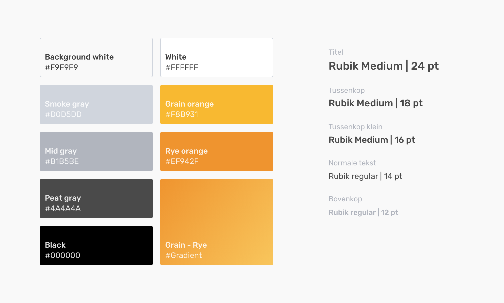

# Visuele stijl

## Font en kleurcombinatie

Om een ​​begin te maken, heb ik gekozen voor een basispalet van grijs, met een vleugje geel en oranje om ervoor te zorgen dat bepaalde elementen meer opvallen. Als lettertype heb ik Rubik gekozen uit google fonts. Het is een speels lettertype met afgeronde randen, maar is ook zeer modern en functioneel voor schermontwerp en een populaire en toegankelijke keuze.

Het lettertype is herkenbaar door de ronde hoeken welke omgezet zullen worden naar vormen en patronen en op deze manier elementen te creëren samenhangend zijn. Ook zijn de afgeronde hoeken een goede leidraad voor de en pictogrammen.

